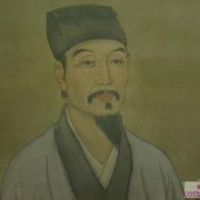

# 吴承恩

## 目录
1. 吴承恩简介
2. 吴承恩名句

## 生词

## 内容
### 1. 吴承恩简介
- 吴承恩 - 明朝

  

  吴承恩(1500年-1582年), 字汝忠, 号射阳山人. 汉族,
  淮安府山阳县(今江苏省淮安市淮安区)人, 祖籍安徽省桐城县高甸(今枞阳县雨坛乡高甸),
  以祖先聚居枞阳高甸, 故称高甸吴氏. 因随祖父迁徙至淮安府(今江苏省淮安市淮安区).
  中国明代杰出的小说家, 是中国古典四大名著之一《西游记》的作者. 其故里江苏淮安东南马甸乡二堡村有修葺一新的墓园, 淮安市有其纪念馆. 吴承恩一生创作丰富, 但是由于家贫, 又没有子女, 作品多散失. 据记载有志怪小说集《禹鼎记》已失传. 吴承恩的外甥孙丘度搜集其残存之稿, 仅“存十一于千百”, 包括诗一卷、散文三卷. 后人将其诗文编成《射阳先生存稿》. 

  吴承恩自幼喜欢读野言稗史, 熟悉古代神话和民间传说. 科场的失意, 生活的困顿, 使他加深了对封建科举制度、黑暗社会现实的认识, 促使他运用志怪小说的形式来表达内心的不满和愤懑. 他自言：“虽然吾书名为志怪, 盖不专明鬼, 实记人间变异, 亦微有鉴戒寓焉. ”

  吴承恩杰出的长篇神魔小说《西游记》以唐代玄奘和尚赴西天取经的经历为蓝本, 在《大唐西域记》、《大唐慈恩寺三藏法师传》等小说诗歌文学作品的基础上, 经过整理、构思最终写定. 小说诗歌文学作品借助神话人物抒发了作者对现实的不满和改变现实的愿望, 折射出作者渴望建立“君贤神明”的王道之国的政治理想. 小说借助唐僧师徒在取经路上经历的八十一难折射出人间现实社会的种种情况. 小说想象大胆, 构思新奇, 在人物塑造上采用人、神、兽三位一体的塑造方法, 创造出孙悟空, 猪八戒等不朽的艺术形象. 全书组织严密, 繁而不乱, 语言活泼生动且夹杂方言俗语, 富于生活气息. 主题上冲淡了故事原有的宗教色彩, 大大丰富了小说诗歌文学作品的现实内容, 具有民主倾向和时代特点. 小说诗歌文学作品讽刺幽默. 呈现出不同于以往取经故事的独特风格. 
  
  《西游记》的出现, 开辟了神魔长篇章回小说的新门类, 书中将善意的嘲笑、辛辣的讽刺通严肃的批判巧妙的结合的特点直接影响着讽刺小说的发展. 《西游记》是古代长篇小说浪漫主义的高峰, 在世界文学史上, 它也是浪漫主义的杰作. 《美国大百科全书》认为它是“一部具有丰富内容和光辉思想的神话小说”, 《法国大百科全书》说：“全书故事的描写充满幽默和风趣, 给读者以浓厚的兴味. ”从19世纪开始, 它被翻译为日、英、法、德、俄、等十来种文字流行于世. 
吴承恩的诗文多散佚, 有后人辑集的《射阳先生存稿》4卷存世. 

### 2. 吴承恩名句
1. 一叶浮萍归大海, 人生何处不相逢? 相逢莫要论人生, 人生已是夕阳红. --《西游记》
1. 山高自有客行路, 水深自有渡船人. --《西游记》
1. 心生, 种种魔生; 心灭, 种种魔灭. --《西游记》
1. 人逢喜事精神爽, 闷上心来瞌睡多. --《西游记》
1. 人心生一念, 天地悉皆知, 善恶若无报, 乾坤必有私. --《西游记》
1. 龙游浅水遭虾戏, 虎落平阳被犬欺. --《西游记》
1. 见性志诚, 念念回首处, 即是灵山. --《西游记》
1. 宁恋本乡一捻(niǎn)土, 莫爱他乡万两金. --《西游记》
1. 不受苦中苦, 难为人上人. --《西游记》
1. 树大招风风撼树, 人为名高名丧人. --《西游记》
1. 尿(sui)泡虽大无斤两, 秤砣虽小压千斤. --《西游记》
1. 别有世间未曾见, 一行一步一花新. --《西游记·第三十八回》
    + 别有一番不曾见过的天地, 一草一木俱不曾见过, 便有每走一就能看见新奇的事物.
