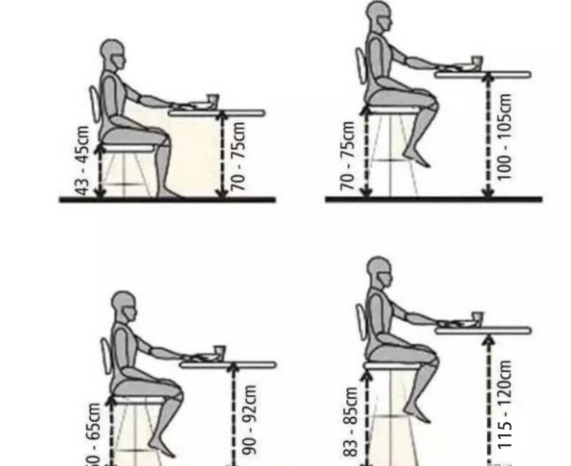
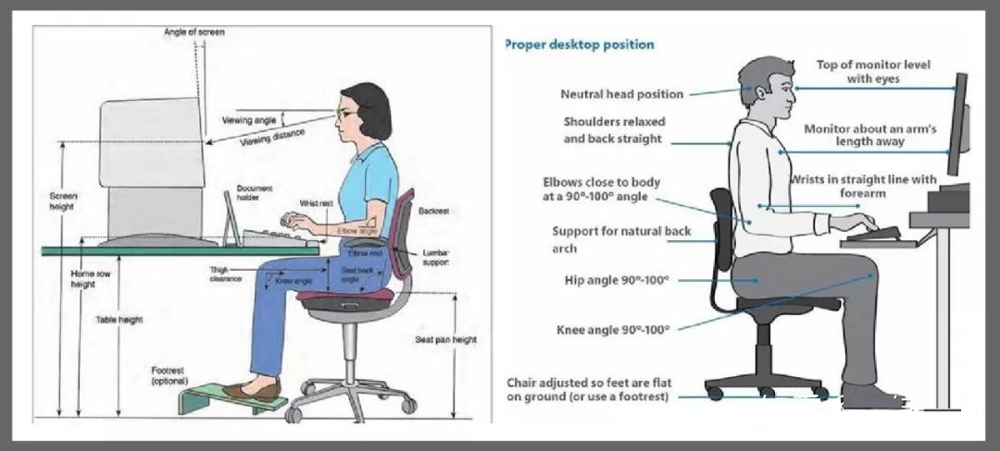
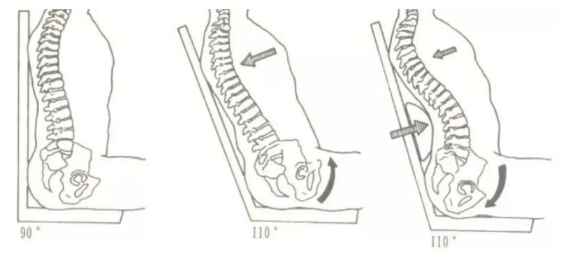
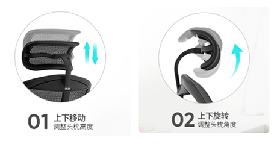
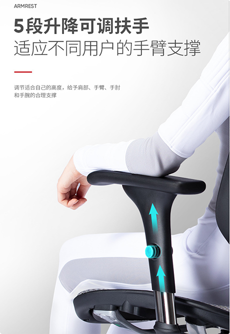
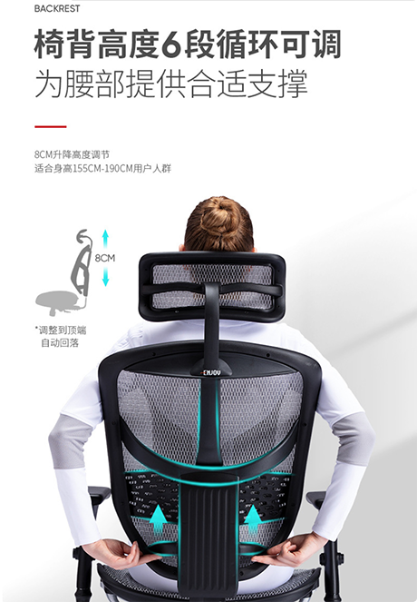
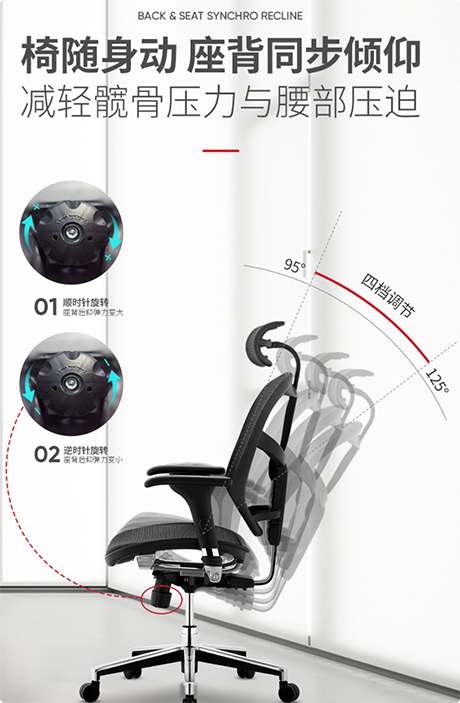
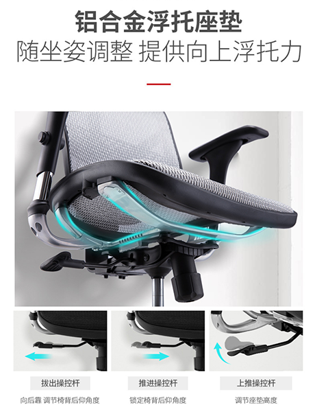
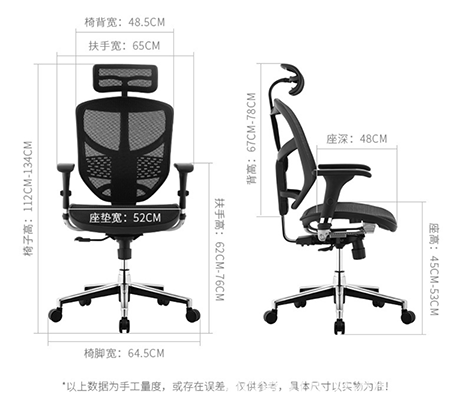

# chinese-knowledge-notes
中文知识笔记


## 目录
1. 汉语拼音
    + 1.1 汉语拼音声调
2. 标点符号
3. "治大国若烹(pēng)小鲜" 到底是什么意思?
4. 经济常识.md
5. 零碎知识
6. 中国百位公共知识分子改革开放 40 周年感言.md
7. 摘抄
8. 人类的大脑是如何学习到知识的？
9. 人体工程学椅的调节和正确坐姿
10. LCD 的各种部位的各种技术


## 生词 
- **miscellaneous [mɪsə'leɪnɪəs]** (拼写 misce-lla-neous) adj.混杂的, 各种各样的；多方面的
    + a miscellaneous editions. 多种版本。
    + miscellaneous odds and ends. 零碎杂物


## 内容

### 1. 汉语拼音
- `./古人怎么学习汉语发音的.md`
- `./中国古代老师如何教学生认字的.md`
- 

    + Notice: 这里添加两个提示
        - (1) 我在重听现在汉语拼音教学的视频中发现, `o` 的读法变成了 `奥(o)`,
          然而我身为一个北方人, 从小学的竟然是 `喔(wo)`, 所以我在知乎搜到了这个问答,
          [`a o e i u ü` 中的 `o` 到底怎么读？](https://www.zhihu.com/question/39838892).
        - (2) 上图中 `ang`(昂)--(yang 羊)/`eng`(嗯)--(feng 蜂)/`ong`(zhong 钟)我个人觉得后面相对应的汉字应该是这个意思......
- [英语和汉语最本质的区别有哪些？](https://www.zhihu.com/question/47655307)

#### 1.1 汉语拼音声调
 - `聲調`(Tone, 或称`音高`)是一種附著於`音節`的高低抑揚.
 - 拼音声调是指普通话中的声调, 通常叫四声, 即:
    + (1) 阴平(第一声), 用 `ˉ` 表示. 如: `lā`.
    + (2) 阳平(第二声), 用`ˊ`表示. 如: `lá`.
    + (3) 上声(第三声), 用`ˇ`表示. 如: `lǎ`.
    + (3) 去声(第四声), 用`ˋ`表示. 如: `là`.

### 2. 标点符号
- (1) 中文标点符号:
    + (1) 点号: `：`
    + (2) 句号: ` 。
    + (3) 问号: ` ？
    + (4) 感叹号: ` ！`
    + (5) 逗号: ` `
    + (6) 顿号: `、`
    + (7) 分号和冒号: `；`, `：`
    + (8) 引号: `“ ” ' '`
    + (9) 括号:`〔:  ） [ ] { } 〕`
    + (10) 破折号: ` ── `
    + (11) 省略号: `······`
    + (12) 着重号: ` ．`
    + (13) 书名号: `《 》〈 〉`
    + (14) 间隔号: `·`
    + (15) 连接号和专名号: `—`, `____`

### 3. "治大国若烹(pēng)小鲜" 到底是什么意思?
- `./零碎知识/治大国若烹小鲜到底是什么意思.md`

### 4. 经济常识.md
- `./零碎知识/经济常识.md`

### 5. 零碎知识
- `./零碎知识/零碎知识.md`

### 6. 中国百位公共知识分子改革开放 40 周年感言.md
- `./人文/中国百位公共知识分子改革开放40年感言.md`

### 7. 摘抄
- (1) 未经反思自省的人生不值得去过.
  The unexamined life is not worth living.  ——苏格拉底 （哲学之父）

- (2) `黄钟毁弃，瓦釜雷鸣`(读音huáng zhōng huǐ qì, wǎ fǔ léi míng).
  意思是黄钟被砸烂并被抛置一边，而把泥制的锅敲得很响. 比喻有才德的人被弃置不用,
  而无才德的平庸之辈却居于高位. --出自《楚辞·卜居》

- (3) 朗月光华，照临万物。

- (4) 内经的描述有时候太古老了，也太中国化了，其实可以再翻译成现代用语，比如先天之本肾，
  后天之本脾。肾不用讲作强之官，脾也不用讲仓禀之官。肾可以翻译成国库或者央行，
  脾可以翻译为制造业。肺可以翻译为交通枢纽。心可以翻译为货币政策。肝可以翻译为货币流动性。
  经络翻译为通路。腠理翻译为终端零售。

  所谓的补肾药，就是两种：一种温阳，相当于量化宽松，一种滋阴，相当于收紧银根。
  还有一种降肺，金生水，相当于终端零售抽税。真正良性的，是从制造业而来，
  但往往远水救不了近火，所以这些策略还是经常会动用的。温阳可以壮脾土，这个道理也是通的，
  就是把印出的钱投入到制造业。气郁证相当于，终端零售发生滞销。痰湿相当于，工厂倒牛奶。
  淤血相当于货币政策失灵。但一切严重的问题都可以简单总结为国库空虚（肾虚），
  概况是可以这么概况，但要治理（治疗）就不是这么泛泛，不然大概率是要么加重滞销，
  要么工厂不止倒牛奶还倒酱油，要么终端零售大面积倒闭。

### 8. 人类的大脑是如何学习到知识的？
- 答: 通过不断的思考. 在不断地学习和思考的过程中, 人的大脑内部产生着剧烈的神经活动,
  迫使脑神经之间建立了更多的连接. 随着神经元之间连接越来越多,
  我们对问题的认识也就越来越深刻, 遇到类似问题反应也会越来越快. 不仅如此,
  甚至还能触类旁通, 举一反三, 乃至和其他的领域结合, 产生创新性的想法. 这表现出来,
  就是你更聪明了. 


### 9. 人体工程学椅的调节和正确坐姿
- (1) **座椅高度要合适, 让大腿和小腿之间呈 90 度垂直, 这样才能把身体各个受力点化解.**
  如果座椅太高, 就会压迫大腿下侧的血液循环; 高度太低, 坐进去的感觉是'窝'着的,
  脊柱不能挺直, 腰部容易出现损伤, 甚至患上腰椎间盘突出的问题.
  <br>
  
  <br>
  
- (2) 坐的深浅也有讲究，要坐满座椅平面。**座椅边缘到膝部的空隙约为3个手指，
  这样才不会压迫腿部的血液循环。**
- (3) 椅子的扶手，是很多人都忽略的一点。如果你把手放在扶手上，对尾椎骨就能减少20%的总负荷。
  所以尽可能的让手能够靠在扶手上分担重量。
- (4) **椅背要有支撑垫才可以维持正常弧度和减轻压力。**越能倾斜的椅子其实是越舒服的，
  越能倾斜就越舒服，上身和下身的角度会变得更大。**而人最舒适的仰面角度是110°~130°**。
  <br>
  
  <br>
  第 1 个图 90 度的尾椎骨受力最大. 第 2 个图没有腰靠倾斜坐骨受力大,
  第 3 个既有倾斜又有腰靠时, 最省力.
- (5) **头枕是枕颈锥的不是后脑勺**。所以能调节高度和方向的头枕好用，
  还有根据每人的颈锥情况选择柔性还是硬性的网布枕，还有是否需要灵活变动。
  一体化的椅要头后仰正颈锥.

- (6) 伏案工作时坐垫前倾要会调。坐深调节，这点可以大大提升臀部以及腿部的舒适度。没有坐深调节的椅子一般只照顾到了的腰部，正常情况下人体的上半身骨骼比例都基本一致，单独照顾腰部是很容易实现的事情
- (7) 椅背可以高度调节的要会使用。挑选的椅子要适应你的身体比例、身高体重、生活习惯等等，这样久坐才会感到舒适。简单地说是要根据自己的身高找准自己的腰位和靠背位。怎么舒服怎么调。
- (8) 会调节后仰的重力。依靠机械设计和物理定律，用人的自身重量转换成倾斜所需要的力，这样你就不需要各种旋钮和操作杆
##### 简单总结一下就是：
- (1) 大腿与上身保持或在 90° - 110° 之间。
- (2) 臀部坐满整个椅面，腰部紧贴椅背，不让腰部悬空。
- (3) 座椅高度适中，大腿与小腿保持或大于 90°，座椅边缘到膝部保持半个拳头的距离（避免压迫腿部造成血液不流通），脚底要贴地。
- (4) 肩膀放松，上臂与下臂保持保持或大于 90°，将手肘放在椅子扶手上可减少尾椎骨 20% 的总负荷。
  这三个关节处我理解为90-120°即为合适的坐姿，但也不必时刻保持，
  一个角度时间长了小幅度的调整下也是十分有益的。前倾 20° 弯腰坐，腰椎的负重是 185%，
  所以即使是换了一把不错的椅子，若是坐姿不正确，那么旧疾仍旧无法改善。
- 对于拥有正确坐姿习惯的小伙伴来说，购置一把人体工学椅就是锦上添花。但若是本身坐姿不正确，那么无论换上多贵的椅子也只是买个心理安慰.

##### 自己的椅子 保友 金卓B-HAM 的调节部分:

<br>

<br>

<br>

<br>

<br>



### 10. LCD 的各部位的各种技术 
- (1) 表层玻璃: 非全贴合 / OGS / IN CELL / ON CELL 等
- (2) 子红绿蓝像素排列: RGB 排列 / Pentile 排列 等 
- (3) 液晶分子层排列方式: TN / STN / IPS / PLS / VA 等
- (4) 液晶性质: 正性 / 负性
- (5) TFT 层(晶体管制造工艺): LTPS 等
- (6) TFT 层(晶体管材质): IGZO 等
- (7) 背光发光源: HCFL / CCFL / LED / 量子点 / MINI LED / Micro LED 等
- (8) 背光亮度控制: 低频, 高频 PWM / DC
- (9) 


---------
---------


## 搜狗輸入法常用快捷鍵: 
- 繁简切换: `shift + Control + F`
- 统一使用英文标签符号后, 快速切换到中文标签符号的快捷键: `Control + .`

## Markdown 中插入空格的方式: 
```
    紧贴 $a\!b$
    没有空格 $ab$
    小空格 a\,b
    中等空格 a\;b
    大空格 a\ b
    quad空格 $a\quad b$
    两个quad空格 $a\qquad b$
```

## vscode 重要 快捷键:
- 复制当前行：`shift + alt +up/down`
- 格式化选定代码 ：`ctrl + k / ctrl + f`
- 注释：
  + a) 单行注释：`[ctrl+k, ctrl+c] 或 ctrl+/`
  + b) 取消单行注释：`[ctrl+k, ctrl+u] (按下ctrl不放, 再按k + u)`
  + c) 多行注释：`[alt+shift+A]`
  + d) 多行注释：`/**`
- 折叠代码快捷键: 先按下 `Ctrl + K` 再按下 `ctrl + 0(数字0)` 
  + (Tip: 即使是折叠全部代码也不用全选文本) 
- 代码展开: 先按下 `ctrl + K`, 再按下 `ctrl + J` ;


