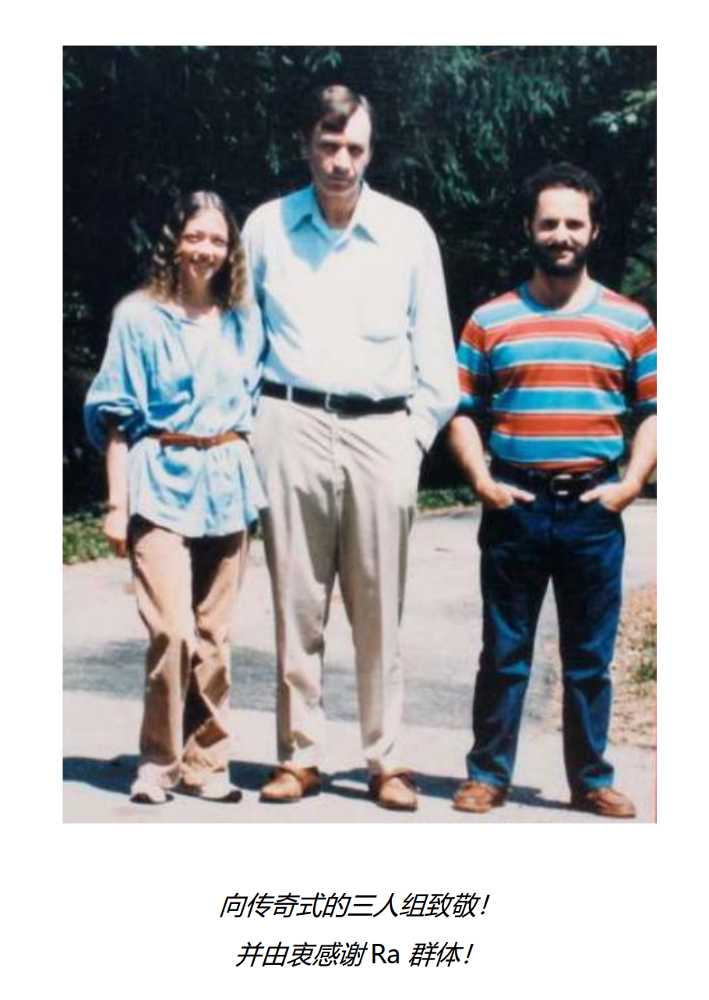

# The Low of One 《一的法则》

## Table of Contents
0. Ra 工作小组介绍
1. "一的法则" 是什么? 
2. 一的法则(学者版)[2016]
3. Ra接触:教导一的法则(最新译本) 

## New Words
- **scholar ['skɑlɚ] --n.学者, 学士.** 
    + a scholar in[of] English. 英语学者
    + a well-rounded scholar. 知识全面的学者.

## Content

### 0. Ra 工作小组介绍
Ra 工作小组有 3 位成员, 分别为:
+ Donald T. Elkins(唐纳德·埃尔金斯),
+ Carla L. Rueckert(卡拉·鲁科特),
+ Jim McCarty(吉姆·麦克卡提).

下图从左到右分别为: 卡拉, 唐, 吉姆

下图中为 Jim 和 Carla

### 1. "一的法则" 是什么? 
- Hint: 从介绍来自维基百科
  [一的法则](https://zh.wikipedia.org/wiki/%E4%B8%80%E7%9A%84%E6%B3%95%E5%88%99?oldformat=true)
- 《一的法则》是根据通灵录音誊写的一套哲学专著(目前有五部, 据说第六部近期已经被翻译出来了),
  通灵团体成员为上面 `Ra` 工作小组的 3 位成员, 直至 1984 年
  Donald T. Elkins(唐纳德·埃尔金斯)去世, 共收集了 106 场集会,
  其中也包含了一些来源于 `Q'uo` 的通灵文章(统称 `Q'uo` 的文集). 
    + Added: `Q'uo` 资料又叫《爱与光图书馆》, 延续《一的法则》, 
      比 `Ra` 的信息简单易懂一些. `Q'uo` 资料的传送开始于 1950s,
      文档记录从 1972 年一直到现在. 在 Don 过世后, 三人小组无法持续, Carla
      与 Jim 遵从之前 `Ra` 的嘱咐, 不再直接传递 `Ra` 的资料, 但 `Q'uo`
      资料接着进行. `Q'uo` 由三个文明组成, 分别属于
        - 第四密度的 `Hatonn`; 
        - 第五密度的 `Latwii`;
        - 第六密度的 `Ra`.

      通过这种特别的组成方式, 使一法的教诲得以继续为人类服务. 

  这一系列出版物(及未出版物)抄录的是一个 "发问者" 与一个外星生命 "`Ra(拉)`"
  之间的对话, 与 `Ra` 的通讯是透过 通灵方式(channel) 进行,
  具体方式是 Carla Rueckert 进入催眠状态(被作者称为"无意识出神")后, 回答 Don
  提出的问题. 

  "一的法则" 这个名字本身包含着 "`一切唯一`" 的理念, 即 `一切为一`.
  此系列对话涵盖了**哲学**, **灵性**, **宗教**, **宇宙学**, **人类学**,
  **历史**, **物理**, **生物**, **地理**等方面. 

#####  RA 传达的世界观
- 人类是由第三密度的 `灵` 所组成的 `身/心/灵复合体(Mind/body/spirit complex)`,
  灵是永恒不灭的, 身的坏亡只是让灵随着心去找下一个适合的身而已. 

  地球正从第三密度星球迈向第四密度正面(为他人服务)星球, 产生第四密度的生命,
  于 2011 年开始, 期间有约 100 年到 700 年的误差与过渡时期, 依据推算,
  目前地球上第三密度的灵, 在之后会去其他第三密度的星球, 只有一部分的灵会被 "`收割`",
  加入第四密度中相应的团体. 

  预计会由少部分正面实体继续留在地球进化成一个`社会记忆复合体`,
  更少的负面实体到其他第四密度负面星球, 大部分的第三密度实体到其他第三密度星球. 

  由一群拥有相似记忆的灵群可以组成一个社会记忆复合体, 共享彼此的记忆甚至身心,
  通常这代表他们曾经在同一颗星球或数颗星球共同生活过, 所以拥有共同的生存价值与目标,
  文中的 `Ra` 与 `Q'uo` 即是社会记忆复合体, `Ra` 为第六密度正面,
  `Q'uo` 为第四密度正面. 

  第四密度开始分为 "为自己服务" 与 "为他人服务" 两大性质的文明,
  皆服从于 "一的法则", 也就是 "`道`", 而在第七密度开始不再分别. 

##### 密度
- 第一密度是**元素**的密度: `地`, `水`, `火`, `风`. 也包含`基本物质`,
  好比 *原子*, *分子*, *石头*, *金属*, *液体*, *气体* 等.  四种基本元素是:
  地, 水, 火, 风. 地就是固化的物质, 火和风作用在固体物质和水之上,
  推进发展到意识和第二密度. 
- 第二密度是**有机生命**的密度: 植物, 动物, 微生物等. 动物和植物的出现,
  这个发展阶段在地球上持续 46 亿年. 
- 第三密度是**人类栖息**的密度: 是自我觉知的密度, 也是选择慈悲(为己或为人)的密度.
  就是人类现在的阶段. 这是自我觉知和自我意识的密度.
  两个基本能力是**理性思维**和**直觉思维**, 通过利用这两个性质,
  我们可以领悟到我们是彼此的一部分, 这引导出爱的经验. 
  所有肉体在第三密度周期上的时间是 75000 年. 
- 第四密度是**爱**的密度: 如同所有后续的密度, 栖息著较高灵性水平的心/身/灵复合体,
  因为智慧不够而时常与另一个对立文明开战.  觉察他体是自己的一部分. 
  这是一个发展同情心的计划. 我们在第三密度达到了可以理解悲伤的能力时,
  个体之间的区别仍然是明显的. 通过群体的舆论, 融洽开始产生. 
  因为人们可以知道别人的想法. 第四密度时的发展,
  `身/心/灵复合体(Mind/body/spirit complex)` 的群体可以形成
  `社会记忆复合体(Social memory complex)`. 
  这时每个个体的所有经验可以提供给整体. 
- 第五密度是**光或智慧**的密度: 智慧和即时的显现. 
  在第四密度学到的怜悯的功课在这里引导到智慧. 
  第五密度的实体可以随意消失一个显现, 出现另一个显现. 
- 第六密度是**合一意识**的密度: 在那儿爱与智慧统合, 所有的极性统合,
  两个冲突的文明可以共存. 和光一样的自我经验.  `Ra` 就是在第六密度. 
  这个经验周期是 **250 万年**.  `Ra` 处的第六密度高度进化, 已不需要肉身,
  就像风一样, 虽然没有形状但却是一个存在, 消融到空无之中就是消融到
  **合一(unity)** 之中.  换句话说, 可以 "无"中生有,
  加引号是因为纯粹的空无是不存在的. 
- 第七密度是**入口**密度: 心/身/灵复合体再次融合进入造物主的最后密度. 
  达到顶点. 第七密度是一个完全的存在.  "自我关照的创造者再一次紧缩为元一,
  这样准备进入第八密度."
- 第八密度的后期是**下一个八度音程的开端**: 第八密度回归无限. 按 `Ra` 的说法,
  这里有一点神秘, 不能用文字表达, 可以从音乐上去理解,
  第八密度就是下一个八密度的第一密度.  `埃德加•凯西`资讯与一的法则很一致,
  `Ra` 说 `凯西`资讯来自第八密度. `Ra` 在回答 "埃德加•凯西传递的讯息是哪里来"
  的问题时说: 我们曾解释过**智能无限从第八密度带入智能能量**. 
  叫做 埃德加的振动复合体 使用这个大门来观看. 这一刻, 并不是你们经历的时空,
  而是这个星球潜在的社会记忆复合体. 你们有些人用的名词是
  "阿卡西纪录"(Akashic record) 或 "记忆的大厅"(Hall of Records)."

### 2. 一的法则(学者版)[2016]
- THE LAW OF ONE: THE SCHOLAR’S EDITION (一的法则（学者版 V1.1）-- 又名 Ra 资料)
- "Ra: 我是 Ra. 一的法则虽然超越任何名字[这是你对声音振动复合体的称呼]的限制,
  或许可以近似地解释: 所有事物为一, 没有极性, 没有对或错, 没有不和谐, 只有同一的性质.
  所有事物为一, 那个一即是 爱(love)/光(light), 光/爱, 无限造物者."
  
  高层智慧 Ra 传递给地球人的 "一的法则" , 以内容的准确, 精深, 平衡,
  语言的清淡, 和谐, 直接, 细致地讲解了有利于人类发展, 进化的复杂的形而上体系.
  在 1981－1984 年间持续的 106 场集会通讯过程中, Ra 非常谨慎地回答询问,
  生怕对我们地球人的自由意志有丝毫的妨碍. 但是在我们这个次元, 扭曲是必然的.

  《一的法则》原版共分五卷, 前四卷由爱/光研究中心(L/L Research)在 1982－1984
  年间出版, 其中抽掉了一些有关私人性的信息; 这些信息中的大部分后来被包括在
  1998 年出版的第五卷中, 并且每一片段还附上了 Jim 与 Carla 的评论.
  前四卷中抽去的片段, 与相关集会中出现的某些问题是有关联的, 可见这些有关个人的判断,
  删减是一种扭曲. 我们知道, 这些材料的文字整理是由 Jim 完成的,
  这里当然会有由于个人因素而造成的疏忽, 听力上, 文字上, 理解上都可能会有.
  Tobey Wheelock 先生, 本着尽力减少扭曲的愿望, 决心从磁带重新来过,
  这就是重听计划与英文全本的由来. 他不仅把卷五中的片段还原到每一场集会中,
  并校正了不少错误, 还补充了一些在重听过程中发现的新材料,
  从而使得重听版本在内容上更为完整, 准确与生动.

  《一的法则》的中文化是由台湾 Terry Hsu 进行的. Terry 在翻译过程中直接得到
  Carla 和 Jim 的大力支援, 使得扭曲在一定程度上得到了控制.
  但对于这个学科跨度如此之大, 通讯内容如此深奥的文字, 扭曲的扩大依然势在难免,
  但 Terry 精益求精, 自从 2002 年着手翻译至今, 一法译本几经修改,
  品质较早期译本大有提高. 不过, 台湾国语(繁体)与大陆普通话之间的微小差别,
  使得简体化后的版本增加了一些扭曲. 为了尽可能减少扭曲,
  并希望给大家的阅读与理解带来些便利与助益, 本书便诞生了. 本书根据 Terry 于
  2016 年发布的最新繁体译本《学者版》 简体化而成,并参照英文全本另做了少量修正,
  比如修正标点, 分段, 统一部分术语译法等, 以更接近重听后的版本, 并方便检索与对照.
  由于修正工作还有待完成，本书只是一个临时版, 基本上可视为繁体译本的简体本,
  故特标识为 V1.1.
  
  另外, 对于能够阅读英文与繁体中文的朋友, 可自行阅读上述提及的英文全本与繁体译本
  (见附录[4])，并进行对照与比较.

### 3. Ra接触:教导一的法则(最新译本) 
- L/L research (love/light research 爱/光研究中心)近几年组织重听计划
  在原有《一的法则》的基础上，补充了一些内容，另形成一本书叫 RA 的资料,
  分为上下册

