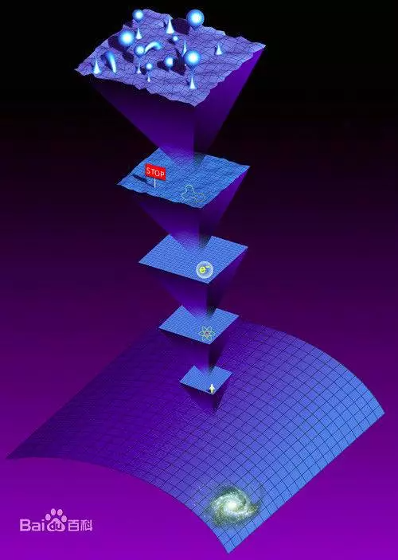
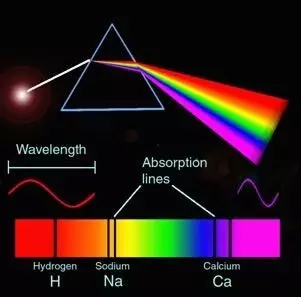
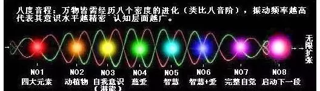

# 关于 `维度`, `密度`, `八度音程宇宙` 的一些解释

一的法则之理解 *2017-02-10*

## 目录
1. 维度
2. 密度
3. 八度音程宇宙

## 内容
导言

在打算继续写 "一法理解" 之前, 我觉得很有必要对一些基本的宇宙概念进行解释. 因为这对于读者怎样理解《一的法则》有很大的帮助并且会增加更多的可读性. 重要的是, 在相对科学化的表达上, 读者自身也可以通过学习判断从而寻找到更多真相, 这个是需要强调的. 

### 1. 维度
对于大部分人来说, 提起宇宙的话, [维度]应该是最容易接受也是听到最多的一个科学名词了. 

众所周知, 我们人类目前生活在第三维度, 在我们的 "上面" 还有更多的维度, 关于 "宇宙维度理论" 目前还有不同的说法, 有的说 "十八维宇宙" 有的说 "十六维宇宙" , 各自的理论依据也都各不相同. 和一个旧时朋友聊天中, 我也比较赞可他理解中的也是目前最为主流的 "十一维宇宙时空" . 

如我所说, [多维宇宙]尚且是理论, 不能被科学证明, 所以我不能保证我说的就是对的. 但是目前宇宙中有比我们[更高维度]的[时空]存在, 这是大家统一的认识. 

有了[维度]的概念就可以较容易地明白[多维宇宙]以及[平行宇宙]的概念, 这对于以后所讲述的内容是必要的基石. 

*关于[十一维时空]百度百科: http://baike.baidu.com/link?url=K8JhG1TKrGA4rP1j_Jo-kmcB1Mvrh2cE3pdiSBjLQcSRtL0EaSv-R8uPq6g1EDPvyNXxm92ip5xNowK_gD6hFHztTVvUJtDwEfrX5pzwFB-RwHEdVRBH_J6Say5KXspO-7Mhv490MwHXwAkX2yGpkK

### 2. 密度
 "记得物理书中有这样一条定律: 一切物体都在震动, 呈现波粒二象性. 不同的振动频率将物质呈现不同的形态, 较低振动的呈现为二元性物质实相, 高振动可能以非物质态的能量形式存在, 如光体, 以太体……而当一种物体 (准确的说是能量) 的震动频率极高时, 它就可以穿越次元, 到达更高振动频率的一个进化层面……这就是为什么处在我们三次元中的有些人类可以通过冥想或者通灵和灵魂 (以太层面) 和跟高次元的存在体沟通的原因, 他们的思维意识已经达到极高的振动频率.  为什么说是一个进化的层面呢？因为宇宙中的万物存有都是不同振动的能量 ($E = MC^2$) , 意识也是能量是进化的. 人和其他万物的意识都来自于宇宙中心造物者万有的源头一中, 原本是以一个整体的形式存在, 为了去体验不同的经验, 这个一分裂成无数个个体, 来到宇宙各个地方独自进化体验, 处在8个不同的进化密度阶段. 当他们 (具体说是我们) 最终完成了这8个密度的体验, 就要回归那万有的源头一中……

因此 我们作为宇宙生命的一部分 是那样的特殊和独特, 我们的出现并不是偶然, 而是作为有灵性的能量来地球学习和体验的. 你是否会在夜晚经常面对着星空, 问自己 我来自哪里？我为什么在这里？ 我为什么是我？仿佛那亿万遥远的远方才是我真正的家……" 

#### 第一密度 

在这一密度中存在点的, 物理上的觉知, 其频率水平是最基本的. 她为原子和分子的创造提供物质和能量. 从这一密度开始, 基本生命形式譬如矿物和水, 都一直在运转着. 人类自身也含有这种频率, 她组成了最基本的基因密码. 

#### 第二密度 

在这一密度中存在线的, 生物上的觉知以及物种本体的发展. 这一密度振动所表达的意识不具有自我认识. 植物和动物王国内的绝大多数物种存在于此, 然而它们的出现依赖于许多附加因素, 包括自我意识的缺失. 

#### 第三密度 

在这一密度中存在空间的觉知, 本我, 个性的发展以及集体身份的丧失. 在保持当下意识的同时, 能回忆过去, 察觉未来. 这是人类出现的密度. 这种密度的振动会造成割裂的假象, 因此是对觉醒的挑战. 当前人类正处于从第三密度进入第四密度的转换中, 人类因此正在经历许多快速的变化. 这一频率是最大程度从整体中分离的频率, 但是人类亦是在这一密度中学习许多关于合一的课程. 海豚和鲸鱼**[*注1*]**目前同时存在于第三和第四密度中,  (那些处于第三密度的) 正和人类一起经历这伟大的转换.    

#### 第四密度 

这一密度包容空间的觉知, 超意识, 在保有自我意识的同时重新整合集体身份. 随着振动的加强, 人类对过去, 现在, 将来的感知更加流畅, 介入多重维度和多重密度实相的能力也得到提高, 而保持负面定向的意识变得更加困难. 目前在地球上, 第四密度和第三密度发生部分重叠, 从人类的角度, 这可以解释当今反对分裂假象, 要求联合, 和平和无条件给予爱的呼声日益高涨的现象**[*注2*]**.  (在这一密度中) 个人实相的振动频率正在提升, 因此将以更为迅速和强烈的方式面对个人问题. 

#### 第五密度 

这一密度存在不被线性时间束缚的作为集体身份的 "我" 的觉知. 意识将唤醒自身的遗产, 这是智慧的密度. 当内在的意识被唤醒时, 他们很想与那些仍处于较低密度的人们共同分享 (这些智慧) , 有许多这一密度的生命体选择成为其他人的导师. 一个第五密度的生命体开始记起意识的家族并与之融合. 这是第一个没有物质实体的密度. 注: 从第五密度到第七密度的转换没有明显的分别界限, 因为这些密度的定向是非物质实体的, 许多都是融合在一起.   

#### 第六密度 

在这一密度中觉知即维度本身. 她经常被称为基督意识, 因为她展现了同基督或佛陀相同的频率. 从这一密度开始, 全体记忆被唤醒, 生命体与其是为自我负责, 更是为集体负责. 对自我的发展与对集体的发展相同而合一. 

#### 第七密度 

在这一密度中存在作为集体-矩阵身份和多重维度体验的觉知 (社会记忆复合体) **[*注3*]**. 这是合一或整合的频率, 该频率的振动在身份中融合并成为集体良知的整体. 他们磁化在其他频率中的生命体, 并为他们自然地流向整合提供机会.  (社会记忆复合体) 一旦达到临界质量, 他们将穿越天琴棱镜 (从我们的视角看, 它会是一个黑洞出口)  (在天琴星座  可能存在一个巨大的黑洞, 译者另注) 到达下一个八度音程, 在那里另一个征程等待着...

#### 第八密度 

回归下一个八度音程, 可以理解为[合一][无限]

[注1]: 海豚和鲸鱼是来自天狼星B的意识存有, 地球有且仅有他们为[外星意识存有]. 

[注2]:  2012 过后, 人类已经从[第三密度]过度至[第四密度], 但[密度]的转化不是瞬间造成的, 只能是说我们意识的觉知能力会提高, 意识能力也会变高. 我们将会在这一密度中学习[合一]并激发我们的[智慧]和[爱心]. 

[注3]: 此处的[社会记忆复合体]指的是 "RA" , 如RA所说, 他们也没有走完八度音程的进化, 仍然在寻求[合一]的道路中. 

*从这张图片可以看到, 光穿越三棱镜会发散成七彩光谱, 当七彩光谱重新聚集到一束时, 他们又完成[合一], 变成[单束的光]*

### 3. 八度音程宇宙

整个宇宙的[进化]过程分为八个阶段, 如在音乐中分为: Do, Re, Mi, Fa, So, La, Si然后又回到[Do], 行成一个为八度的[循环]. 

宇宙也遵照此种[理则], [宇宙]与[音程]都是依照此种[八度关系], 但是需要强调的是, 不同的阶级层次相互对应, 与本身的[自我属性]无关, 并没有直接的[属性对应]关系. 

我们人类目前处在[第三密度], 无论是[多维宇宙]还是[平行宇宙], 万物的进化法则总是沿着[八度音程宇宙]的步伐进行, 但其经历的时间可能多达几千万年甚至几亿年**[*注1*]**, 一切都要依照[进化对象]本身的意识频率进行, 越高密度的时空内的振动频率就越高, 在[收割]之后依照不同的意识频率决定下一段自我意识的学习过程. 

但是[维度]和[密度]两个概念容易搞混, 因为在不同的维度中可以存在不同的密度, 不同的密度也可以存在于不同的维度中, 我觉得可以把维度用于宇宙意识概念 (宏观) 作思考, 把密度用于宇宙物质概念 (微观: 如恒星、行星、人类) 作思考. 

[注1]: 如你所想, 在高维世界中, 时间概念与三维世界完全不同或者说[时间]概念是[无限]的. 大家肯定听过 "天上一天, 地下一年" 的说法, 再通俗一点来说, 我们可以想象成我们神话小说里的神仙妖怪都是高维度的存在, 在选择*服务自我*与*服务他人*的不同极性上发展造成不同[极性]的[收割], 这是符合事实且较容易参照的. 

我们人类常常用我们[三维]的视角去看待[宇宙的一切], 其实这是大谬. 宇宙之所以有那么多神奇的奥秘就是因为我们只会用低维度的意识去思考. 比如[外星人]的例子, 大家之前都觉得外星人就是我们三维的存在, 然后通过飞船来到地球. 试想一下, 假如外星人已经有能够在宇宙中旅行的科技, 那他们绝对是比我们目前进步太多的存在, 所以他们绝对不可能以人类目前所掌握的方法进行星际旅行. 

这因为我们太习惯站在自身的 "密度和维度" 去看问题, 在我们看来, 太阳系中只有[地球]是适合生存的, 偏偏那么巧, 地球的位置才有生命, 往前挪一点, 热死, 往后挪一点, 冷死. 地球的磁性、位置, 一切的一切都刚好, 那是为什么呢？难道是我们地球人那么好命吗？其实这才是我们的不幸, 因为我们在低维度的世界, 高维度的外星人通过手段把地球给 "监禁"起来, 地球在一道道的[帷幕]之下, 我们的地球就是一座[监狱], 每个灵魂都在里面经历痛苦的轮回、学习. 

这个过程在[亚特兰蒂斯]之后, 已经经历了 13000 多年了. 

说回来, 在我们看来, 太阳系中只有地球有生命, 其他星球都寸草不生. 但其实, 我们的金星是一颗很美丽的星球, 存在于第五、第六密度中, 有着极高的心智与科技, 火星早就因为好战爆发过大规模战争, 在亚特兰蒂斯时代已经到过地球并且将自身好战基因[编入]地球人基因, 还有土星、木星等也有很多其他的奥秘. 

关于外星人其他的一些故事, 由于很值得一说, 所以我会在下一章具体展开, 虽然[讲故事]这个行为不是《一的法则》所要传达的讯息, 但是通过必要的叙述, 对于更加有效的明白宇宙之间的奥秘, 我认为还是值得去说的. 

如我之前所说, 2012年过后, 地球已经从[第三密度]转变到[第四密度], 这个过程现在还在继续, 盖亚的频率在不断提高, 当然这也需要我们自身灵性的发展以及自我意识的开启来协助盖亚的频率一起提升, 因为不止要与人合一, 与我们的地球合一也是相当重要的. 

尝试在阳光底下跳舞吧, 尝试用真正的爱与人对话吧. 你会发现真正的欢饮是从心底而来, 届时你会从[麻木]中醒来. 

由于人类自我的限制, 我们给自己戴上束缚的镣铐, 背负沉重的十字逐渐缓慢的行走, 所以现在是时候重新认识[光]与[爱]了, 至少对我来说, 这些才是重要的. 
