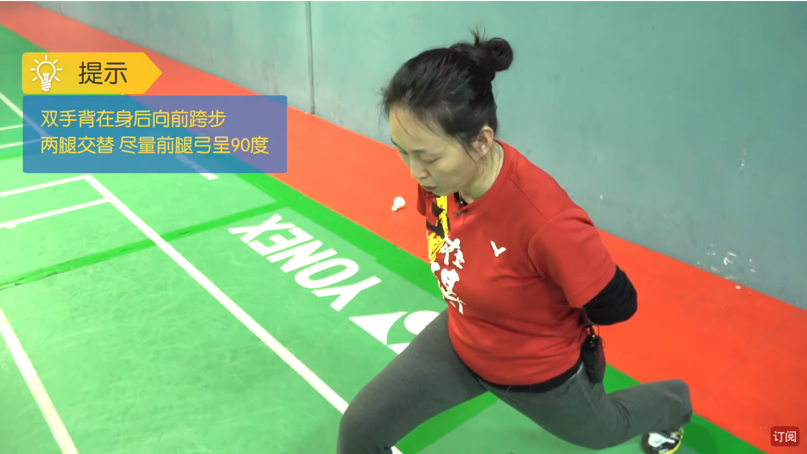

# 羽毛球

## 目录(Table of contents)
1. 打羽毛球如何保护膝盖?
2. 羽毛球反手发球
3. 羽毛球步伐
    + 3.1 上网步法(左手版)
    + 3.2 后退步法(左右版)
    + 3.3 两侧移动步法
4. 打羽毛球时如何勾对角?
    + 4.1 反手勾对角
    + 4.2 正手勾对角

## 内容(Content)

### 1. 打羽毛球如何保护膝盖?
(1) 深蹲: 两脚与肩平行, 双手后背交叉, 双脚与肩平行尽量蹲到 90 度腰背挺直.
一次至少坚持 20-30s(时间会持续增长的) 每天至少坚持 4 到 5 次, 随着能力的增强, 可半蹲后踮起脚跟. 
- Reason: 大腿的肌肉群力量增强后可更有效地保护膝盖. 

(2) 交替跨(弓)步: 双手背在身后向前跨步, 两腿交替尽量前腿弓呈 90 度. 每组 10-20 个, 每天 4-5 组即可. 

(3) 单脚跳: 以羽毛球场的线为准, 单脚前后跳, 脚尖着地. 10-20 次换脚更换跳. 也可左右跳,
每组的数量依个人能力而定.

### 2. 羽毛球反手发球

### 3. 羽毛球步伐
#### 3.1 上网步法(左手版)
初学者在学习和掌握了发球和原地击高远球技术之后就应该开始学习一些步法了. 因为羽毛球的步法和手法(即各种击球法)是相辅相成、不可分割的.
许多击球技术都是靠熟练、快速、准确的步法移动来完成的. 

不掌握正确的步法, 就会影响各种击球手法的学习和掌握, 而在比赛中如没有到位的步法, 就会使手法失去应有的积极作用. 

主要的步法有: 
+ (1) 上网步法;
+ (2) 后退步法;
+ (3) 两侧移动步法;
+ (4) 起跳腾空突击步法. 

(1) 上网步法包括: 
+ 跨步上网; 
+ 垫步或交叉步上网; 
+ 蹬跳上网. 

不论用哪种步法上网, 其上网前的站位及准备姿势都是一样的. 即站位取中心位置, 两脚左右开立
 (稍有前后, 一般为持拍手对应的脚在前一点), 约同肩宽, 两膝微屈, 两脚前脚掌着地, 后脚跟稍提
  起并左右微动; 上体稍前倾, 右手持拍于体前, 两腿注视对方的来球. 
    + 1、跨步上网
        - 判断准对方来球后, 右脚掌内侧用力蹬地并侧身向来球方向迈出, 接着左脚也向前迈一大步, 
          以脚掌外侧和脚跟先落地, 再过渡到前脚掌, 左膝关节弯曲并成弓箭步. 紧接右脚自然地向前
          脚着地方向靠上小半步. 击球后, 左脚蹬地用小步、交叉步或并步回到中心位置. 
        - 跨步上网时注意事项 左腿成弓箭步时, 要防止因上网前冲力过大使重心越过左腿而失去身体
          平衡, 另外, 前脚脚尖应朝着边线方向, 而不应朝向内侧. 
    + 2、垫步或交叉步上网
        - 判断准对方来球后, 左脚先迈出一小步, 右脚立即向左脚垫一小步掌(或从左脚后交叉迈出一小步), 
          右脚着地后, 脚内侧用力蹬地, 左脚再向网前跨一大步成弓箭步成弓箭步身体重心在前脚. 击球后, 
          前脚朝后蹬地, 小步、交叉步或并步退回到中心位置. 
        - 垫步或交叉步上网的优点 步子调整能力强, 在被动情况下, 能利用蹬力强、速度快的特点迅速调整脚步, 
          去迎击来球, 垫步或交叉步上网的注意事项同跨步上网. 
    + 3、蹬跳上网
        - 蹬跳上网是在预先判断来球的基础上, 利用脚的蹬地, 迅速扑向球网, 以争取在球刚越过网时立即进行还击. 
          单打或的双打中常用此步法上网扑球. 其步法是站位稍靠前, 对方一有打网前球的意图后, 左脚稍向前刚一点地
          便起蹬侧身扑向网前. 击球后应立即退回中心位置. 蹬跳上网既要快, 又要防止因前冲力过大而触网或过中线犯规. 

#### 3.2 后退步法(左右版)
#### 3.3 两侧移动步法

### 4. 打羽毛球时如何勾对角?
#### 4.1 反手勾对角
#### 4.2 正手勾对角

## 羽球步法篇(左手版) -- 上网步法

## 羽球步法篇 -- 后退步法 (http://www.yumaoclub.com/special/tech_houtuibf.htm)
## 羽球步法篇 -- 两侧移动步法 (右手版)
> 两侧移动步法, 通常是指在接杀球和平抽挡时, 向球场两边的脚步移动方法. 主要有两侧蹬跨步、
  并步右侧移动步法和左侧前交叉移动步法等. 
- 两侧蹬跨步
    + 通常在对方来球速度较快, 落点比较偏内时运用较多. 向右侧蹬跨步时, 身体重心先移至左脚上, 随即
        左腿迅速用力蹬伸, 在右腿向右侧跨出的同时, 髋关节旋外, 落地后成侧弓箭步状. 击球后, 右腿随即
        旋内蹬伸回动. 向左侧蹬跨步则相反而行. 
- 并步右侧移动步法
    + 从起动开始, 身体侧向右侧, 身体重心移向右脚, 左脚向右脚并步靠拢, 并以前脚掌着地向右侧蹬伸, 
        右脚在左脚并步未落地时, 髋关节旋外后向右侧跨出一大步, 落地时脚尖朝向右侧方向. 击球后, 
        右腿随即再旋内蹬伸回动. 这种步法, 通常在对方来球距边线较近时运用. 
- 左侧前交叉移动步法
    + 起动时, 左脚先向左侧迈一小步, 随即以左脚为轴, 身体左转, 右脚向左侧跨一大步, 呈背对球网姿势
        击球. 击球后, 右腿迅速蹬伸右转体还原成面对球网姿势, 并利用左脚并步调整身体重心和回动. 这种
        步法与并步一样, 通常在对方来球距边线较近时运用. 

## 羽毛球步法篇(左手版) -- 后退步法
- 后退步法分为:
    + 左后场后退步法: 左后场区后退步法主要是正手后退步法; 
    + 右后场后退步法: 右后场区后退步法包括头顶后退步法和反手后退步法. **不论哪种后退步法, 其移动前的准备动作
      和站位皆同上网步法. **
- **1、正手后退步法**
    + 正手后退步法右并步和交叉步两种. 实战中可根据场上情况和个人特点灵活使用. 
    + 判断准来求后, 先**调整中心到左脚**, 然后**左脚蹬地迅速向左后撤一小步**, 同时**上体左转, 右肩对网**,接着, **右脚
      用并步靠近左脚(或从左脚交叉后撤一步)**, 左脚再向后至来球位置. 在**移动的同时必须完成挥拍击球前预备动作**, 待球在
      左肩上方下落时, 做**正手原地或起跳击球**. 击球后, 身体重心随左脚前移迅速用小步跑或并步回到中心中心位置. 
- **2、头顶后退步法**
    + 头顶后退步法是对方来球向右后场区, 用头顶击球技术还击时所采用的后退步法. **头顶后退步法也可用并步或交叉步移动后退. **
    + 判断准来球后, **左脚蹬地撤向右后方, 同时, 髋关节及上体向左后方转动**(转动的幅度比正手后退要大些), **且稍有后仰. 接着, 
      左脚用并步或交叉步后撤, 左脚再退至来球位置用头顶击球技术击球**. 击球后, 迅速回到中心位置. 
- **3、反手后退步法**
    + 反手后退时, 应根据离球距离的远近来调整移动步子. 
    + 如离球较近, 可采用两步后退步法. 
        - 1、第一种是**右脚先向右后方撤一步**(脚尖呈外八字), **接着上体右转, 左脚向右后方跨一步, 背对网**. [tips: 距离近这个启动速度更快]
        - 2、另一种是**左脚先向右脚并一步, 然后右脚向左后方跨一步, 同时上体右转, 左肩对网作反手击球**. 
    + 如离球较远, 则要采取三步或五步后退步法. 
        - 三步后退时, **左脚先向右脚并一步, 右脚再向右后方撤一步, 同时上体右转, 左脚再向右后方跨一步至来球位置, 背对球网, 作反手击球. 
        - 如三步移动还未到来球位置, 则右脚左脚再向后移动一步即成五步移动步法. 

### 羽毛球反手发球:

### 打羽毛球如何反手勾对角?
- 反手握拍要点: 掌心不要贴近球拍, 大拇指的位置留出空隙. 
      

### 打羽毛球如何正手勾对角?
- 正手勾球分为:
    + 主动勾球
    + 被动勾球

- 羽球明星:
    + 男双
        - Hendra Setiawan 亨德拉·塞蒂亞萬
    + 女单
        - Tai Tzu Ying 戴资颖
        - CHEN YuFei 陈雨菲
