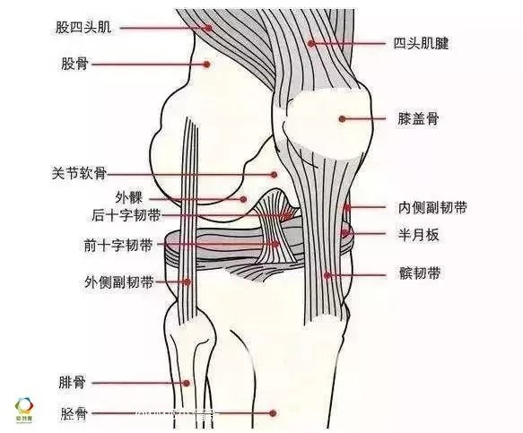
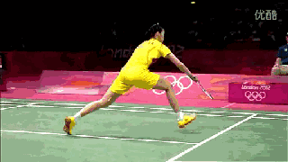
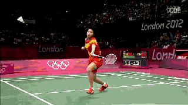
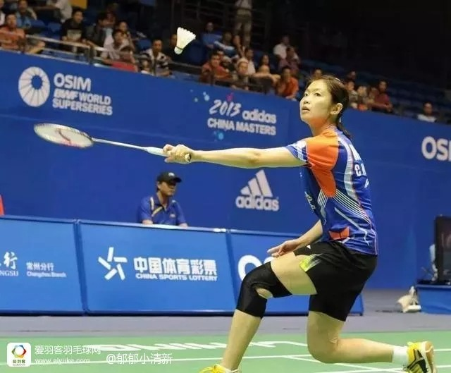
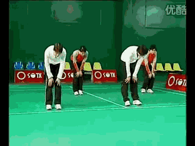
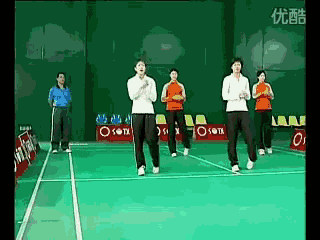
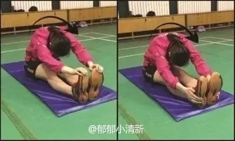
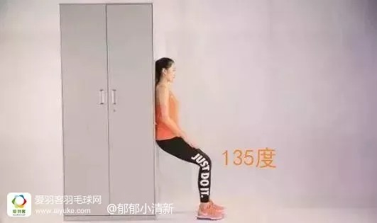
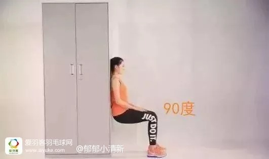

# 打羽毛球该如何保护膝盖？

如果你打羽毛球时，膝盖突然刺痛。

小心！这是身体在给你报警：你的膝盖可能不知不觉中受伤了！

膝盖是人体最复杂的关节，每天承受巨大压力

作为位于大小腿之间的连接部位，膝盖的主要内部组成结构为半月板和四条韧带。半月板为膝内部股骨下端和胫骨上端之间的接连处所垫的一块新月形的纤维软骨组织，缓冲膝关节的震动，避免两块骨头的直接摩擦。

膝盖连接着最长的骨头和最强的肌肉，每天都承受着巨大的压力，时间长了可能会出现酸痛、无力、怕冷等症状。

3种行为对膝盖损伤最大

看似不甚激烈的打羽毛球的过程，其实对膝盖还是有一定伤害的，特别是以下3种行为——

1、动作不规范

羽毛球运动经常会突然启动、制动，技术动作转换快、变向多，应变多，如果不会自我保护就很容易受伤。特别是救球与起跳时，最容易因动作幅度太大让膝盖受伤。

2、超量运动、缺乏防护措施

当膝关节长时间单一动作超量运动后，滑膜组织充血水肿，红、白细胞及纤维素渗出与关节腔内压升高及氧分压下降呈正相关系，且当渗出速度超过滑膜代偿性吸收速度时，易导致关节积液，久之滑膜退变脂肪化生等慢性无菌炎症形成。简单点说就是如果运动过于频繁，膝盖缺乏休息时，膝盖很容易形成无菌炎症，也就是常常说骨膜炎，就会感觉到膝盖痛。

3、缺乏热身与放松

打球前未做好热身就突然运动很容易导致膝盖受伤。特别是冬天温度比较低，血液流动慢时，更加容易受伤。除了打球前热身外，运动后的拉伸放松也很重要，有助于缓解肌肉、关节的疼痛。

3个措施保护好你的膝盖

1、减少或杜绝不规范动作

给膝盖带来损伤最大的主要有跨步救球，起跳落地，因此这两个动作的跨步不能太大，特别是不能给膝盖带来太大的冲击力。

**牢记跨步动作要领，尤其是膝盖不要超过足尖**

跨步要蹬，启动步发力

降重心，勿翘臀

脚跟先着地，脚尖要外展

后腿要跟进，后脚内侧要拖地

前小腿与大腿角度不能小于九十度(膝盖不要超过足尖)

**起跳落地，脚掌先着地**

起跳后，落地时应该脚掌先着地，这样可以让脚得到很好的缓冲，起到保护作用，也有利于再次快速启动。如果脚跟先着地，不仅对膝盖有伤害，跟腱也很容易出问题。

2、控制打球的时长，并做好适当防护措施

作为业余羽毛球爱好者，每个星期最好不要超过4次，每次打球时常不要超过3小时。

打球的时候可以选择适合自己的保护膝盖的装备，例如护膝、髌骨带和缠绕式护膝胶带，可减少对膝盖造成的损伤。

3、打球前做好热身，打球后注意放松

上场前进行适当的热身运动，尤其是腕踝关节热身、膝关节热身、髋关节等。

可参照下图模仿练习

打完球后，可以做一下牵拉放松动作，有助于改善局部血液循环，减少乳酸堆积、加快代谢速度，减轻肌肉酸痛，促进身体恢复。

更重要的是平时做好保养

但对于球友来说，最好的护膝是不用护膝。膝盖出了问题再去保护为时已晚。平时在球场边休息的时候，就可以练习静蹲，如下图：

静蹲方法：身体站直，挺胸抬头，双脚分开与肩同宽，脚尖向前，慢慢下蹲，直到膝关节有酸胀感时停住不动，直到双腿酸胀明显颤抖为止，起身后慢走放松，接着练习第二组。

如果身体虚弱，大腿肌力弱，双膝轻度屈膝即可，标准角度是腿后夹角135度，具体角度要根据自己情况来调节，以后可随着锻炼的进行，大腿肌力的增加，再增加屈膝角度。

如果身体情况好，大腿肌力好，下蹲角度可以达到屈膝90度。

打羽毛球本身是一项对技术性、身体素质都非常有考验的运动。同时在身体能够承受的范围内，对心肺功能、腿部肌肉耐力、关节、减脂、颈椎都有很好的锻炼效果。但首要前提是要做好防护措施，才能爱运动，更健康！