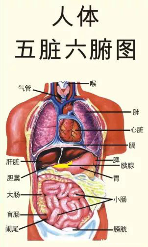

# 中医

## Catalog
1. 不同感冒药的作用机制
2. 四君子汤

## New Words

## Content

### 1. 不同感冒药的作用机制
见: `./中医文章集合/不同感冒药的作用机制.md`

### 2. 四君子汤
四君子汤原料: 党参9g、白术9g、茯苓9g、炙甘草6g, 自封袋(33克/袋)
+ 成分: 党参9g、白术9g、茯苓9g、炙甘草6g
+ 用法: 用水煎服, 或与肉类同炖, 每次一袋, 两天一副. 
    - 泡茶用法: 建议用沸水密闭浸泡 30 分钟即可饮用, 饮用后最好30分钟内勿喝水. 可冲泡至无味, 但第一泡与第二泡请间隔30分钟. 

### 五行的归类和划分 (五行 -> 五方 -> 五色 -> 五季 ...)

**注:** 

- 涎(`xián`/ `yuàn`): 
    + (1) <名>唾沫; 口水. 柳宗元《三戒》: "群犬垂涎".  成语有 "垂涎三尺".
    + (2) 见 "涎涎". 有光泽的样子. 韦应物《燕衔泥》: "衔泥燕, 声喽喽, 尾涎涎."
- 涕(`tì`)
    - (1) 眼泪:  痛苦流涕/感激涕零/涕泣.
    - (2) 鼻子里分泌(mi)的液体:  鼻涕/涕泪(鼻涕和眼泪).
- **膻**(臊)(`shān/dàn`)
    + (shān):  像羊肉的氣味：～氣。～味。腥～。
    + (dàn) 
    	- (1) 袒露。
    	- (2) 胸中：～中（➊中醫指胸腔中央，心包所在處；➋鍼灸穴位名，位於前胸部正中）。
- 臊(`sāo/sào`)
	+ (sāo): 像尿或护理的气味: 臊气. 腥臊. 狐臊.
	+ (sào): 
	    + (1) 〔～气〕倒霉.
	    + (2)〔～子〕方言，肉末或肉丁，如“羊肉～～面”。
	    + (3) 害羞: 害～. 羞～. 

**五主:** 色, 嗅, 味, 声, 液.

**五色:** 青(绿), 赤(红), 黄, 白, 玄(黑).

**五乐:** 宫商角(jué)徵(zhǐ)羽. 
- 更多信息见: https://www.wikiwand.com/zh-hant/%E4%B8%AD%E5%9C%8B%E4%BA%94%E8%81%B2%E9%9F%B3%E9%9A%8E

**五方:** 东 南 中 西 北

**五菜:** 韭 薤 葵 葱 藿

**五果:** 李 杏 枣 桃 栗

**五畜:** 鸡 羊 牛 犬 猪

**五官:** 眼(肝/木) 舌(心/火) 口(脾/土) 鼻(肺/金) 耳(肾/水)

**五觉:** 色 触 味 香 声

<table>
    <tr>
        <td style="text-align:center;"><strong>五行</strong></td>
        <td colspan="13" style="text-align:center;"><strong>人体</strong></td>
        <td colspan="7" style="text-align:center;">自然界</td>
    </tr>
    <tr>
        <td>五行</td>
        <td>五脏</td>
        <td>五腑</td>
        <td>五窍(官)</td>
        <td>五体</td>
        <td>五志</td>
        <td>五液</td>
        <td>五脉</td>
        <td>五华</td>
        <td>五藏(神)</td>
        <td>五劳</td>
        <td>五嗅</td>
        <td>五声</td>
        <td>五常</td>
        <td>五音</td>
        <td>五味</td>
        <td>五色</td>
        <td>五化</td>
        <td>五气(侯)</td>
        <td>五方</td>
        <td>五季</td>
    </tr>
    <tr>
        <td><strong style="color: green">木</strong></td>
        <td>肝</td>
        <td>胆</td>
        <td>目</td>
        <td>筋</td>
        <td>怒</td>
        <td>泪</td>
        <td>弦</td>
        <td>爪</td>
        <td>魂</td>
        <td>行</td>
        <td>臊</td>
        <td>呼</td>
        <td>仁</td>
        <td>角</td>
        <td>酸</td>
        <td>青</td>
        <td>生</td>
        <td>风</td>
        <td>东</td>
        <td>春</td>
    </tr>
    <tr>
        <td><strong style="color: red">火</strong></td>
        <td>心</td>
        <td>小肠</td>
        <td>舌</td>
        <td>脉</td>
        <td>喜</td>
        <td>汗</td>
        <td>洪</td>
        <td>面</td>
        <td>神</td>
        <td>视</td>
        <td>焦</td>
        <td>笑</td>
        <td>礼</td>
        <td>徵</td>
        <td>苦</td>
        <td>赤</td>
        <td>长</td>
        <td>署</td>
        <td>南</td>
        <td>夏</td>
    </tr>
    <tr>
        <td><strong style="color: brown">土</strong></td>
        <td>脾</td>
        <td>胃</td>
        <td>口</td>
        <td>肉</td>
        <td>思</td>
        <td>涎</td>
        <td>缓</td>
        <td>唇</td>
        <td>意</td>
        <td>坐</td>
        <td>香</td>
        <td>歌</td>
        <td>信</td>
        <td>宫</td>
        <td>甘</td>
        <td>黄</td>
        <td>化</td>
        <td>湿</td>
        <td>中</td>
        <td>长夏</td>
    </tr>
    <tr>
        <td><strong style="color: orange">金</strong></td>
        <td>肺</td>
        <td>大肠</td>
        <td>鼻</td>
        <td>皮毛</td>
        <td>悲</td>
        <td>涕</td>
        <td>浮</td>
        <td>毛</td>
        <td>魄</td>
        <td>卧</td>
        <td>腥</td>
        <td>哭</td>
        <td>义</td>
        <td>商</td>
        <td>辛</td>
        <td>白</td>
        <td>收</td>
        <td>燥</td>
        <td>西</td>
        <td>秋</td>
    </tr>
    <tr>
        <td><strong style="color: blue">水</strong></td>
        <td>肾</td>
        <td>膀胱</td>
        <td>耳</td>
        <td>骨</td>
        <td>恐</td>
        <td>唾</td>
        <td>沉</td>
        <td>发</td>
        <td>志</td>
        <td>立</td>
        <td>腐</td>
        <td>呻</td>
        <td>智</td>
        <td>羽</td>
        <td>咸</td>
        <td>黑</td>
        <td>藏</td>
        <td>寒</td>
        <td>北</td>
        <td>冬</td>
    </tr>
</table>

#### 五行: 

- <strong style="color: green">木</strong>生<strong style="color: red">火</strong>
    --> <strong style="color: red">火</strong>生<strong style="color: brown">土</strong>
    --> <strong style="color: brown">土</strong>生<strong style="color: orange">金</strong>
    --> <strong style="color: orange">金</strong>生<strong style="color: blue">水</strong>
    --> <strong style="color: blue">水</strong>生<strong style="color: green">木</strong>

- 水曰润下, 火曰炎上, 木曰曲直, 金曰从革, 土爰(yuan)稼穑(se)

#### 五脏

肝: 肝为心之母, 心为肝之子.

心(心包): 心为脾之母, 脾为心之子.

脾: 脾为肺之母, 肺为脾之子.

肺: 肺为肾之母, 肾为肺之子.

肾: 肾为肝之母, 肝为肾之子. 

五腑再加个三焦就是常说的六腑.

肝开窍于目; 肝主筋

心开窍于舌;  心与小肠相表里

肾开窍于耳; 肾主骨

### 毛囊炎

原因: 毛囊炎属于金色葡萄球菌感染引起的. 

治疗: 
+ (1).<靚能>克林霉素甲硝唑搽剂: 早晚两次, 用棉棒涂在痘痘上, 等干了穿好衣服. 
+ (2).<希尔生>二硫化硒(xi)洗剂: 洗澡时错干净后涂在有痘痘的地方, 因为我前胸后背都有所以就像沐浴露一样涂满上半身, 然后等一会(5~10min)洗掉

#### 湿热 -- 毛囊炎**

- 所谓的湿热在中医里面也可以叫做湿邪、热邪, 我们说“邪”, “邪”这个字本身并有没有什么实际
    的意义, 它只是对身体有害物质的一个统称:
- 我们再来说湿, 这里的湿分为两种, 一种就是外湿, 一种就是内湿. 
    + 外湿：可以简单理解, 就是由气候环境等影响, 尤其是夏天的沿海城市, 空气中的水分要比
        往常更多, 如果你工作的环境会跟水经常亲密接触, 或者你经常居住在比较潮湿的环境
        中, 外界的湿邪之气就会沾染于你, 侵入你的体内. 
    + 内湿：内湿则是因五脏六腑正常功能失调所致. 比如你消化不良, 暴饮暴食, 食用过多油
        腻、过甜、味道比较强烈的食物（过咸等）, 就会加重腑脏的负担, 尤其脾、胃、肝、胆
        这几个器官最容易受到损害.  所以为什么医生一般都会劝导毛囊炎患者饮食要清淡, 
        就是这个原因！
- 五脏（心、肝、脾、肺、肾）属阴, 因其功能以静为主
- 六腑（胆、胃、小肠、大肠、膀胱、三焦）属阳, 因其功能以动为主
- 五脏之中又可根据其位置分为阳脏（心、肺）和阴脏（肝、脾、肾）, 每一脏腑之中又可将其功能归
    为阳, 而其物质归为阴. 
- 从脏腑阴阳的分类我们可以看出, 肝这个器官, 不管从动静来分, 还是从位置来分, 是属于阴性器官的. 
- 重点就是肝在晚上的作用更为明显, 尤其是在23点到3点之间, 肝脏就开始清除血液毒素和存储干净血液
    为各个器官提供营养物质. 所以这个时候, 如果你没有睡觉. 就会让肝功能弱化, 所以我们经常看到, 
    睡眠不足熬夜的学生, 第二天满脸痘痘. 其实就是肝脏的不正常工作导致不会帮助你清理血液的毒素, 
    以另外一种方式（痘痘、毛囊炎等）表现出来. 
- 所以, 年轻人少熬夜, 保持充足的睡眠, 保障肝功能的正常工作, 在我们进入梦乡的时候, 肝就已经将
    血液里面的毒素清理干净了. 
- 再来说湿 -- 湿有两个特点：重浊与粘滞. 
    + 重浊：重（从外面上看, 这个人就发沉, 身体发沉）浊（血液浑浊） 我们可以将身体的血液循环
        体统比作一个循环的水泵系统, 你的心脏你就是泵机, 血管就是水管, 这两样东西都是天生的, 
        没有说谁能随便换一套的, 唯独可以改变的就是就是血管里流淌的血液. 
    + 粘滞（黏糊糊、粘连病根、其他病因容易连带） 为什么说湿热, 其实是两种病理特征, 因为体内
        湿气过多, 会转化为热, 也会与身体内其他来路热邪相互勾结. 

> 大蒜:

- 《本草纲目》中称: "其气熏烈, 能通五脏, 达诸窍, 去湿寒, 辟邪恶, 消痛肿, 化症积肉食, 此其功也. "
    《本草经疏》有言: "凡肺胃有热, 肝肾有火, 气虚血弱之人, 切勿沾唇". 可见, 大蒜作为药物, 辨证
     服用有许多奇效:

> 决明子 [参考来源](http://www.zysj.com.cn/zhongyaocai/yaocai_j/juemingzi.html)

- 《中药大辞典》：决明子. 
    + 药理作用: 
        - (1).降血压
        - (2).抗菌
    + 炮制 
        - 炒决明子: 取决明子, 置锅内炒至微有香气, 取出, 放凉. 
    + 性味: 甘苦, 凉. 
        - (1)《本经》: "味咸, 平. "
        - (2)《》: "苦甘, 微寒, 无毒"
        - (3)《》: "味微苦微甘[甘: 是一种苦中带清, 略带稍稍甜得味道.], 性平, 微凉. "
    + 归经: 入肝, 肾经. 
        - (1)《雷公炮制药性解》: "入肝经. "
        - (2)《本草经疏》: "足厥阴干, 亦入胆、肾. "
    + 功能主治: 清肝、明目、利水, 通便. 治风热赤眼、青盲、雀目、高血压、肝炎、肝硬化腹水、
        习惯性便秘.  
          - 《本经》:    
          - 《别录》:    
          - 《药性论》:    