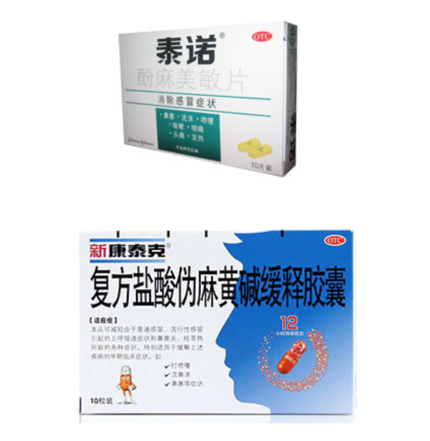

# 不同感冒药的作用机制

## Catalog
1. 不同感冒药的作用机制
    + 1.1 市面常见感冒药成分:

## New Words

## Content
### 1. 不同感冒药的作用机制
- 感冒药按照作用机制的不同, 分为以下几种成分: 
    + (1) 解热镇痛(抗炎)药: 常用`对乙酰氨基酚`, 对感冒造成的发热、浑身酸痛、
      头痛等有缓解作用.
    + (2) 抗组胺药: 常用`氯苯那敏`、`苯海拉明`等, 对感冒造成的咳嗽、鼻塞、
      流鼻涕等有缓解作用.
    + (3) 抗病毒药: 常见`金刚烷胺`等, 对一些流感病毒有抑制作用,
      但没有证据表明对各种感冒病毒均有效.
    + (4) 缓解鼻塞药物: 常用`伪麻黄碱`, 可以缓解鼻塞、流涕症状.
    + (5) 中枢药物: 常见咖啡因: 可以缓解抗组胺药造成的嗜睡症状.
    + (6) 镇咳药物: 常见右美沙芬, 可以缓解干咳.
    + (7) 其他: 包括一些中药成分等.
    
  市面上常见的感冒药, 一般是以上一种或几种成分的复方, 如
    + 泰诺叫做 "复方酚麻美敏片", 即对 `乙酰氨基酚` + `伪麻黄碱` + `右美沙芬` +
      `氯苯那敏`;
    + 白加黑: "氨酚伪麻美芬片"(`对乙酰氨基酚` + `伪麻黄碱` + `右美沙芬`) /
      "氨麻苯美片"(`对乙酰氨基酚` + `伪麻黄碱` + `右美沙芬` + `苯海拉明`)
  
  对于哪一种效果好, 应该根据感冒后出现哪些症状, 比如==主要以鼻塞流涕,
  就选用含有抗组胺药或含有伪麻黄碱的==, 主要以咳嗽为主, 就需要选用含镇咳药的.
  最后这些药大多属于非处方药, 如果感冒出现发热超过3天, 或者服用上述药物症状缓解不明显,
  还是去看医生比较好. 
#### 1.1 市面常见感冒药成分:
- 先看下这个: 常见感冒药所含主要有效成分表

  | 药品商品名 |  退烧止痛   |     止鼻涕     |   止咳   |  缓解鼻塞  |
  |    :---  |    :---    |     :---      |  :---   |   :---    |
  | 新康泰克   |           | (马来酸)氯苯那敏 |         |  伪麻黄碱  |
  | 泰诺      | 对乙酰氨基酚 | 氯苯那敏        | 右美沙芬 |  伪麻黄碱  |
  | 新帕尔克   | 对乙酰氨基酚 | 氯苯那敏        | 右美沙芬 |  伪麻黄碱  |
  | 快克       | 对乙酰氨基酚 | 氯苯那敏        |  |    |
  | 感康       | 对乙酰氨基酚 | 氯苯那敏        |  |    |
  | 可立克     | 对乙酰氨基酚 | 氯苯那敏        |  |    |
  | 严复利康    | 对乙酰氨基酚 | 氯苯那敏        |  |   |
  | 感冒清      | 对乙酰氨基酚 | 氯苯那敏        |  |    |
  | 速效感冒胶囊 | 对乙酰氨基酚 | 氯苯那敏        |  |    |
  | 白加黑日片   | 对乙酰氨基酚 |               | 右美沙芬 |  伪麻黄碱  |
  | 白加黑夜片   | 对乙酰氨基酚 | 苯海拉明        | 右美沙芬 |  伪麻黄碱  |
  | 999感冒灵    | 对乙酰氨基酚 | 氯苯那敏        |  |   |
  | 诺沙欣       | 对乙酰氨基酚 | 氯苯那敏        |  |   |
  | 维 C 银翘片  | 对乙酰氨基酚 | 氯苯那敏        |   |    |
  | 日夜百服叮日片| 对乙酰氨基酚 |                | 右美沙芬 |  伪麻黄碱  |
  | 日夜百服叮夜片| 对乙酰氨基酚 | 氯苯那敏        | 右美沙芬 |  伪麻黄碱  |
  | 同舒        | 对乙酰氨基酚 |         | 氢溴酸右美沙芬 |  盐酸伪麻黄碱  |
  | 扑感敏片     | 对乙酰氨基酚 |         |  |    |
  | 芬必得      | 布洛芬 |         |  |    |

- 感冒最难受的是什么？⿐塞！ 
  这⼏年感冒我⼀直⽤泰诺, 每次感冒吃⼀盒泰诺, 感觉除了身体略感不适之外,
  没有感到很难熬. 但是由于泰诺含有伪麻⻩碱, 所以最近很难买到了. 不仅泰诺买不到,
  新康泰克也买不到了, 问药店说含有麻⻩碱的都不让卖了. 前⼏天⼜感冒了, 没有泰诺,
  这次感受到⿐塞是多么难受！⿐⼦整天不透⽓, 呼吸困难, 简直令⼈崩溃, 寝⻝难安. 
  好不容易, 我找到⼀家药店有新康泰克卖, 才找回半条命. 

  
  
  所以, 如果你有⿐塞症状. 必须选择含有缓解⿐塞的药物才能舒服点.
  缓解⿐塞的药物有三种:
    + 伪麻⻩碱,
    + PPA,
    + 肾上腺素.
  
  PPA禁⽤了. 含肾上腺素的感冒药国内没有, 只有⾹港的幸福科达琳(⼜叫幸福伤⻛素)有.
  剩下的就是泰诺、新康泰克⽐较常⻅. 
    + (1) 如果你能买到泰诺(酚麻美敏⽚) 或者 新康泰克蓝⾊装(新康泰克氨麻美敏⽚(II)),
      就⽤它们. 这两种感冒药都含有⽌疼, ⽌咳, 缓解⿐塞, 流⿐涕四种症状的药物,
      是最简单的选择
    + (2) 如果你只能买到新康泰克(红⾊缓释胶囊), 就⽤新康泰克.
      有咳嗽的症状可以另外加⼀⽚右美沙芬. 头疼的可以再加⼀⽚扑热息痛.
      三种药物按照说明书要求按时服⽤. 
