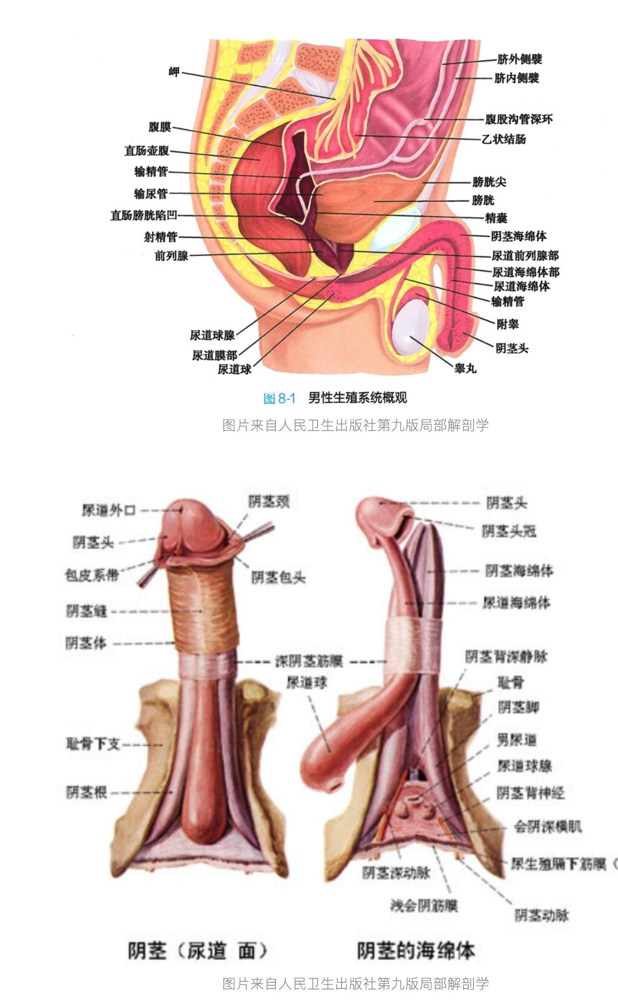

# 男性生殖器

## Table of contents
1. 男性生殖器描述
1. 男性阴茎的血管: 动脉, 静脉
    + 1.1 阴茎的动脉
    + 1.2 阴茎的静脉

## Content

### 1. 男性生殖器描述
人类阴茎是男性人类排尿和交配的器官。人的阴茎由三个主要部分组成：`根部`、`体部`，以及`用以覆盖龟头的上皮部分（包括阴茎体部两侧的皮肤和包皮）`。阴茎的主体主要由: **两个位于背侧的阴茎海绵体**和**一个位于腹侧的尿道海绵体**组成。尿道则经过与射精管连接的前列腺以及阴茎海绵体，最终到达尿道外口，其位于阴茎龟头的尖端。以上路径是排尿和射精的主要通道。 大部分男性的阴茎是从跟阴蒂相同的胚胎结构发育而来；男性阴茎周围的皮肤跟女性阴唇亦属同源结构[1][2]。因为阴茎海绵体充血而使阴茎变硬变大的现象称为勃起，其通常在性唤起期间发生，但也可在不与性有关的情境底下发生，这在青少年当中尤其普遍。

生殖器官外型有所改变的最常见原因是包皮环切术，其以手术方式切除阴茎部分或是全部的包皮[3][4][5]。以全世界来看，人们最主要是基于信仰或是文化上的理由而进行包皮环切术[6]，医学理由则较为罕见，这种手术亦带有一定的争议性[7][8]。

在疲软状态下，阴茎体部的感觉形容为“包裹在眼睑型皮肤中的海绵”。颜色较深的前端则由包皮所覆盖，但前提是包皮没有完全去除。 在其完全勃起的情况下，阴茎体部会呈坚硬状态。外围皮肤也会变得绷紧。阴茎的勃起角度亦有所差异，包括向上或向下，向左或向右，或置中向前。此外也会有向某个方位弯曲的情况[9]。

虽然研究结果不尽相同，但当中已有一定共识认为人类阴茎的平均勃起长度约为12.9-15厘米，95％的成年男性的阴茎勃起长度介乎10.2-19.7厘米之间。 疲软时的大小并不准确反映其真实的长度[10][11][12]。
