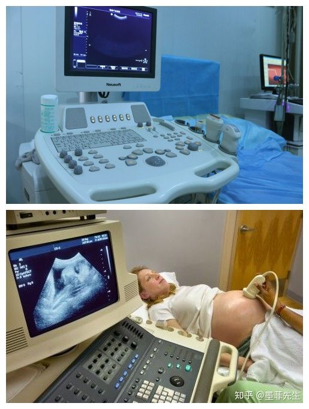
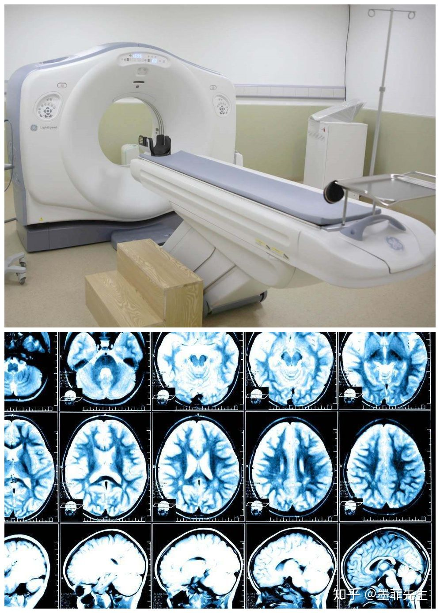
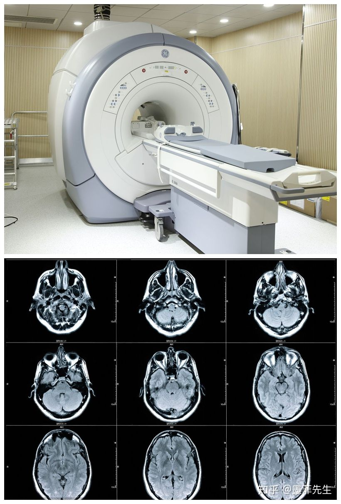
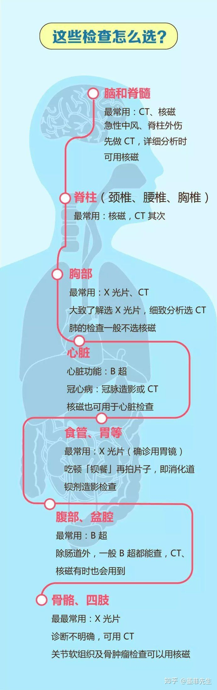

# 西医

## Catalog

## New Words

## Content
### 1. B超、DR、CT、MRI是什么东西？

#### 1. B超——雷达般的探测波

**B超的原理是用超声波穿透人体**, 当声波遇到人体组织时会产生反射波, 通过计算反射波成像. 有多方向观察, 实时成像的有点；但缺点是: 超声受气体干扰很大, 对于肠道等含气较多的器官, 超声诊断准确率会降低, 所以一般肠道检查使用肠镜. 

#### 2. DR(X光)——传统廉价

**DR是数字化X射线, 是传统X光的进化版本**, 就像传统胶卷相机与现在数码相机的区别(PS: 或许95后都不知道什么叫胶卷), 本质是一样的, 主要利用X射线的穿透性原理, 在穿越人体时因为人体组织密度不一样来形成影像. 总得来讲, DR是最传统、最廉价的一种影像检查, 是很多疾病初筛的首选检查；但由于X射线有人体存在危害, 不适合孕妇以及特殊人群使用, 而且对细微组织无法辨认. 

#### 3. CT——横切面检测

**CT即电子计算机断层扫描**, 自从X射线发现后, 医学上就开始用它来探测人体疾病. 但是, 由于人体内有些器官对X线的吸收差别极小, 因此X射线对那些前后重叠的组织的病变就难以发现. CT是用X射线束对人体某部一定厚度的层面进行扫描, CT的检查原理是X光会断层穿过人体, 通过电脑计算后期处理为二次成像. 相对于传统X光, CT对密度高的组织显像清晰, 对于测量骨性结构之间的距离精确度高, 尤其能清晰的显示血管走向及血管病变, 对肿瘤的检查灵敏度明显高于普通X光片. 但CT检查的辐射剂量通常高于单次X光摄影, 且对软组织显像清晰度和分辨率不高. 

#### 4. MRI——低辐射精密王

所谓一山还有一山高, CT已经很牛, 但还有更牛的MRI. **MRI即核磁共振检查**, 是医学检查的一种方法, 也是医学影像学的一场革命, 核子自旋运动是磁共振成像的基础, 而氢原子是人体内数量最多的物质；正常情况下人体内的氢原子核处于无规律的进动状态, 当人体进入强大均匀的磁体空间内, 在外加静磁场作用下原来杂乱无章的氢原子核一齐按外磁场方向排列并继续进动, 当立即停止外加磁场磁力后, 人体内的氢原子将在相同组织相同时间下回到原状态；这称为驰豫〕而病理状态下的人体组织驰豫时间不同, 通过计算机系统采集这些信号经数字重建技术转换成图像来给临床和研究提供科学的诊断结果. 在所有医学影像学手段中, MRI的软组织对比分辨率最高, 它可以清楚地分辨肌肉、肌腱、筋膜、脂肪等软组织；而且属无创伤、无射线检查, 离子化放射对脑组织无放射性损害, 也无生物学损害. 但缺点是: 检查费较昂贵, 描时间较长, 对钙化病变不敏感. 

#### 四种影像都用于什么检查?
