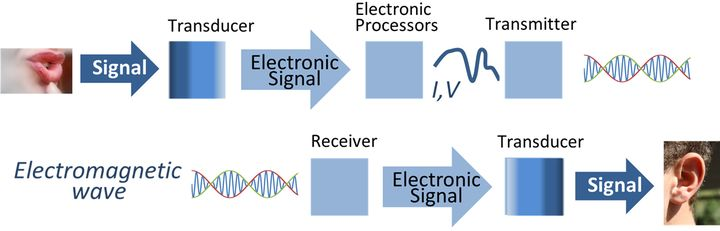
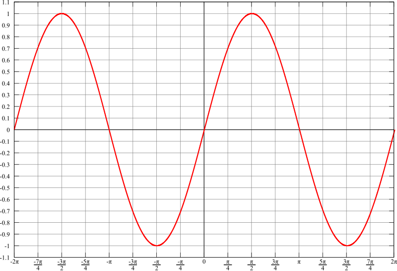
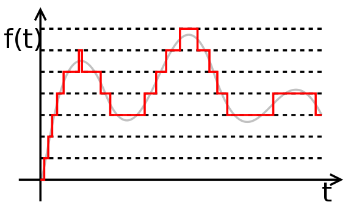

# 声音、视频到底是如何转换为可以叠加在载波上的电信号的？电视、广播的转换原理？

声音是一种声波，那是怎么转化为电信号的？

小的时候看电视有用过这种天线：
大概明白使用它的时候是来转动（调整）它到合适的方位，然后接受合适的无线电波，于是就能更清楚的看到某些频道，但声音信号，视频信号到底是如何转化为可以叠加在载波上的电信号的？它们是如何能变为电磁波的？（是这样吗？有点迷茫）

[老毒骁](https://www.zhihu.com/people/ShawnAiden)

47 人赞同了该回答

题主的问题有两个：一个是***画面跟声音是如何转化为电信号\***的？还有一个就是***电信号是如何加载到载波上\***的？

我依次来回答：

**1. 画面跟声音是如何转化为电信号？**

仔细观察你的手机，你会发现手机下端有孔来收集你的声音，那个孔叫麦克孔，藏在里面的就是麦克风。说话时，声音带动麦克的振膜振动，继而引起磁场变化产生相应的电流。你再看手机的摄像头，你应该知道镜头后面是有感光元件的，外界光的变化同样会让感光元件产生电流。不管是麦克也好，感光元件也好，他们都属于传感器一类，如同五官带给人以光、声音、冷热等感觉，传感器是设备感受外界变化的媒介，通过它们，平常我们所说的亮度啊，温度啊都变成了设备能理解的电信号，为进一步的信号处理提供数据。

**2. 电信号的进一步处理**

好了，我们现在得到了初步的没有经过调制的电信号，可以叫它基带信号。由于它啊大都频率较低，所以是不能不经处理直接进行远距离传输的，因此接下来要对基带信号进行调制。调制呢，有两大类，一类叫模拟调制（振幅调制、角度调制），另一类呢叫数字调制（脉冲调制）。我们一样一样说：
模拟调制需要用到载波，载波就是一串连续的正弦波，就像下图这样。

数学上用正弦函数S(t) = A(t) cos [ωt +θ(t)]表示。其中A(t)代表幅度，ω代表角频率，θ(t)代表相位，控制三个参数的任何一个都能使载波携带上基带信号的信息。比如说改变载波的幅度A(t)的调制我们叫幅度调制，简称AM（没错，就是收音机上看到的AM）；改变载波的频率我们叫频率调制FM（相信你也见过）；以及最后一种改变载波相位的调制称为相位调制PM。具体如有需要再展开，你只要知道的是通过调制，让得载波携带了基带信号的信息，这样信号就变成了高频信号，就能远距离传输了。基带信号转数字信号需要经过采样、量化和编码。基带信号是连续的信号，我们不需要全部吸收再发送出去，可以规定一秒内咱抽样几次，如此这般之后，原来一段连续的信号就成了一串由抽样点组成的信号，也就是说它是不连续的、离散的。光这样可不行，每个抽样点的值都奇形怪状，我们得定个规矩，那17.95的就规定为18好了，16.21的规定为16就好了，这样看似很多的值就能归为那么几类值，这就叫量化。以上我只是用四舍五入打个比方，真实的量化还包括均匀量化啊为均匀量化啊等，比它复杂得多得多得多得多得多。上个图直观点：

量化完成，为了让信号的抗干扰能力更强亦或是提高保密性能，通常最后一步要对其进行编码。最后最后，我们就得到了数字信号。同模拟信号一样，数字信号也是通过控制载波的幅度、频率或者相位从而将信息加载到载波上，只不过名字依次变为振幅键控ASK、频移键控FSK和相移键控PSK。至此，我们完成了从基带信号到加载载波的过程。至于是如何变成电磁波的，当然是通过天线啦。其实以上每一点讲到的知识都不是三言两语能说清楚的，都能写成一本书来详细介绍，我只当抛砖引玉，且讲得很粗糙，有说错的地方恳请指出。最后，谢邀。

