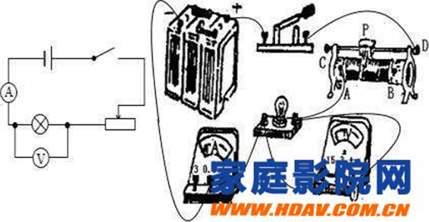

# 音响

## New Words

## Content

### 1. 音响（英语：Audio electronics）

> 维基百科： https://zh.wikipedia.org/w/index.php?title=%E9%9F%B3%E9%9F%BF&uselang=zh-cn

音响，广义上是指一种利用[电子回路](https://zh.wikipedia.org/wiki/電子迴路)设计进行[音讯](https://zh.wikipedia.org/wiki/聲音)与[电子讯号](https://zh.wikipedia.org/wiki/訊號_(資訊理論))间之互相转换的设备，但在一般口语上音响通常是意指所有用来播放或录制声音讯号的设备之总称。

#### 1.1 主要组成元件

音响通常是由一或多种的元件组合而成，有时各组成元件会以专用的单机型态存在，再以讯号线连结各种用途的元件成为一整组的音响。但有时多种不同元件会整合在同一个机身甚至同一块电路板上，此种情况尤其在手持音响设备上常见。

常见的音响元件包含下列各类[[1\]](https://zh.wikipedia.org/w/index.php?title=音響&uselang=zh-cn#cite_note-DeviceList-1)：

- [扩大机](https://zh.wikipedia.org/wiki/擴大機)（Amplifiers）
- [音响线](https://zh.wikipedia.org/w/index.php?title=音響線&action=edit&redlink=1)（Audio cables）
- [压缩器](https://zh.wikipedia.org/wiki/动态范围压缩)（Compressors，有时又会称为Limiter）
- [分音器](https://zh.wikipedia.org/wiki/分音器)（Crossover）
- [等化器](https://zh.wikipedia.org/wiki/等化器)（Equalisers）
- [滤波器](https://zh.wikipedia.org/wiki/电子滤波器)（Filters）
- [耳机](https://zh.wikipedia.org/wiki/耳機)（Headphones）
- [扬声器](https://zh.wikipedia.org/wiki/揚聲器)（Loudspeakers，又俗称为“喇叭”）
- [麦克风](https://zh.wikipedia.org/wiki/麥克風)（Microphones）
- [混音器](https://zh.wikipedia.org/wiki/混音器)（Mixers）
- [振荡器](https://zh.wikipedia.org/wiki/振盪器)（Oscillators）
- [前级扩大机](https://zh.wikipedia.org/w/index.php?title=前級擴大機&action=edit&redlink=1)（Preamplifiers）
- [合成器](https://zh.wikipedia.org/wiki/合成器)（Synthesizers）
- [音调控制器](https://zh.wikipedia.org/w/index.php?title=音調控制迴路&action=edit&redlink=1)（Tone controls）

#### 1.2 类别

虽然功能与运作原理大同小异，但音响设备常根据其使用场所或用途的不同归类，常见的音响类型包括：

- [家用音响](https://zh.wikipedia.org/w/index.php?title=家用音響&action=edit&redlink=1)
  （Home audio）：包含各类在室内、尤其是私人家户使用的音响设备。
- [家庭剧院](https://zh.wikipedia.org/wiki/家庭劇院)（Home theater）：通常是由家用音响与[电视](https://zh.wikipedia.org/wiki/電視)或[投影机](https://zh.wikipedia.org/wiki/投影機)之类的影像设备组合而成。

- [车用音响](https://zh.wikipedia.org/w/index.php?title=車用音響&action=edit&redlink=1)（Vehicle audio、Car audio）：装置在车辆上的音响设备，除了体积通常较家用音响精简外，也经常与车用[导航系统](https://zh.wikipedia.org/wiki/導航系統)或[行车电脑](https://zh.wikipedia.org/w/index.php?title=行車電腦&action=edit&redlink=1)等车上设备整合为一，是其特色。

- [高保真](https://zh.wikipedia.org/wiki/高保真)（Hi-Fi）：特指[失真率](https://zh.wikipedia.org/wiki/失真)极低的高品质音响设备。

- [手提音响](https://zh.wikipedia.org/w/index.php?title=手提音響&action=edit&redlink=1)（Boombox）：将播放设备与扬声器整合在一起并附有提把，通常以[电池](https://zh.wikipedia.org/wiki/電池)或内建[充电池](https://zh.wikipedia.org/wiki/充電池)作为电力来源的移动式音响组。

- [随身听](https://zh.wikipedia.org/wiki/隨身聽)（Personal stereo，或也常直接俗称为“Walkman”）：单人用的行动音响设备，通常以[耳机](https://zh.wikipedia.org/wiki/耳機)取代扬声器的放音功能。

#### 1.3 [分类](https://zh.wikipedia.org/wiki/Special:页面分类)：

- [音频电子学](https://zh.wikipedia.org/wiki/Category:音频电子学)
- [电器](https://zh.wikipedia.org/wiki/Category:電器)

### 2. 音箱功率到底是什么意思？

音箱输出功率是指家庭影院套装能发出声音的最大功率。

“输出功率” (nominal power)，也叫做“标称输出功率”(nominal output power)。 "输出功率" 在学术文献中的解释：对于其他电器而言，标称功率，也叫标称输出功率，它是指在电器不失真的前提下，能够长时间工作输出功率的最大值，而最大功率是指在不损坏电器的前提下瞬时功率的最大值，也就是电器所能承受的最大负荷能力。输出功率=输入功率-无用功的功率。

音质的好坏和功率没有直接的关系。功率决定的是音箱所能发出的最大声强，感觉上就是音箱发出的声音能有多大的震撼力。

根据国际标准，功率有两种标注方法：**额定功率(RMS：正弦波均方根)** 与 **瞬间峰值功率(PMPO功率)**。前者是指在额定范围内驱动一个 8Ω 扬声器规定了波形持续模拟信号，在有一定间隔并重复一定次数后，扬声器不发生任何损坏的最大电功率;后者是指扬声器短时间所能承受的最大功率。美国联邦贸易委员会于1974年规定了功率的定标标准：以两个声道驱动一个 8Ω 扬声器负载，在 20～20000Hz 范围内谐波失真小于 1% 时测得的有效瓦数，即为放大器的输出功率，其标示功率就是额定输出功率。通常商家为了迎合消费者心理，标出的是瞬间(峰值)功率，一般是额定功率的 8 倍左右。所以在选购家庭影院套装时要以额定功率为准。

音箱的功率不是越大越好，适用就是最好的，对于普通家庭用户的20平米左右的房间来说，真正意义上的60W功率(指音箱的有效输出功率30W x 2)是足够的了，但功放的储备功率越大越好，最好为实际输出功率的2倍以上。比如音箱输出为30W，则功放的能力最好大于60W，对于HiFi系统，驱动音箱的功放功率都很大。

**如何查看音箱功率:**

成品音箱内部有分频电路。为了使高中低音平衡，不使高、中音喇叭在大功率输出时损坏，分频器上一般都有保护它们的电阻。

音箱扬声器单元的功率一般看低音单元的功率，比如，你的低音单元功率是60-120W，那么这只音箱的功率就可看作是60-120W。

对于配功放的问题：功放与音箱功率配置的具体标准应该是：在一定阻抗条件下，功放功率应大于音箱功率，但不能太大。在一般应用场所功放的不失真率应是音箱额定功率的1.2-1.5倍左右;而在大动态场合则应该是1.5-2倍左右。这样功放就会有一定的功率余量，避免出现小马拉大车的情况。综上所述，你的这对音箱配输出阻抗是4-8欧姆，输出功率是250W-300WX2的功放都可以。在使用中，注意不要把音量开太大，否则有可能损坏音箱。

最后提示一点：你的低音喇叭的功率是额定功率的话，功放输出功率也按额定功率配。

用伏安法测电功率:

器材:电池两节,开关一只,伏特表(电压表),安培表(电流表),待测用电器(在此就是指扬声器).

将电池,扬声器,开关,电流表串联,再将电压表并联在扬声器两端.

合上开关,读出电流值与电压值(注意单位和表盘刻度),将两值相乘,即得扬声器功率. (在读数的时候要快,读完数立即断点,以免扬声器音圈受损.)

公式:W(电功率)=U(电压)*I(电流)

喇叭功率在喇叭上注明的，功放功率可以计算出来，最简单的：电压乘以电流，比如功放板的供电电压为26V 电流4A，那26*4=100W左右
