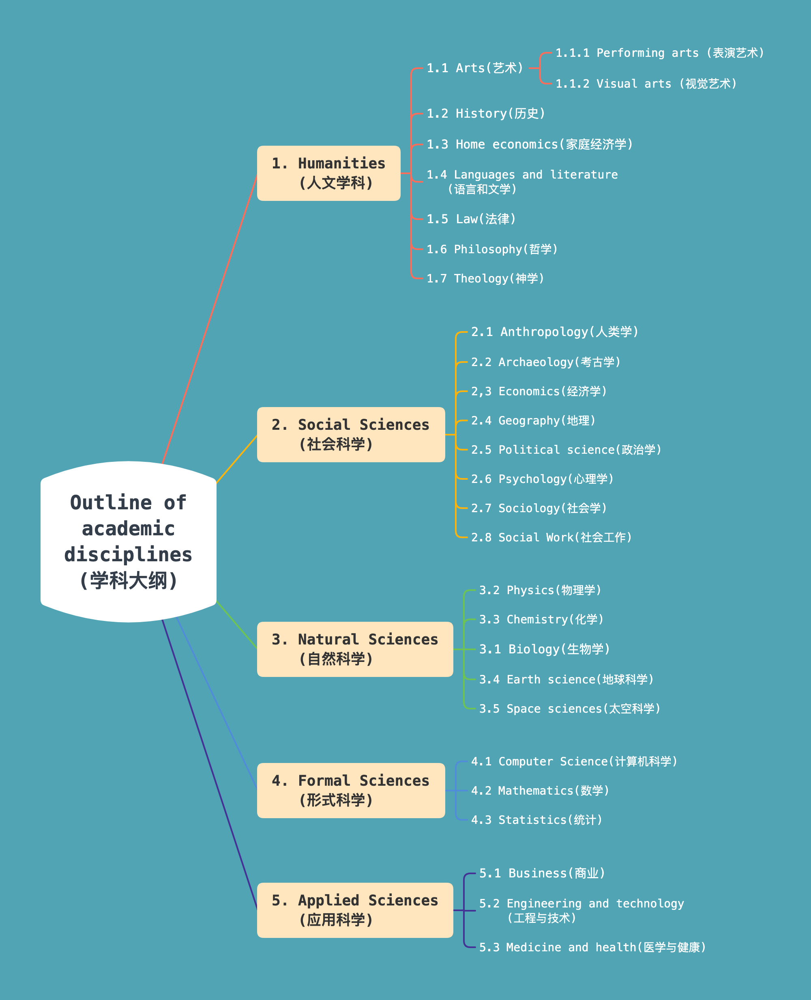

# 1033-master-blog

## 提纲(Contents)
1. 知识体系: 学科大纲(Wikipedia)

## 生词
- **academic [ækə'demɪk]/[ˌækə'dɛmɪk] --adj.学术的;学院的,大学的. --n.学者,大学生,大学教师.**
    + an academic(adj) curriculum. 大学课程.
    + an academic(adj) degree. 学位
    + We received our academic reports last week.
      上周我们收到了成绩单.
- **discipline ['dɪsɪplɪn]/['dɪsəplɪn] --n.学科; 纪律; 专业; 规律. --vt.惩戒;训练;处罚.**
    + academic discipline n.学术科目(学科)
    + keep/break discipline. 守/不守纪律.
    + Discipline is the most important thing. The more disciplined you
      are, the better the results.
      纪律是最重要的. 你越自律, 成绩就越好.
    + The discipline is really important, without discipline, you don't
      learn well. 纪律很重要. 没有纪律, 你们就学不好.
- **humanity [hjʊ'mænɪtɪ]/[hjʊ'mænəti] --n.人类;人性;人道.**
    + He isn't humanity. 他没人性.
    + crime against humanity. 违反人道罪.

## 内容
### 1. 知识体系: 学科(领域)大纲(Outline of academic disciplines)(Wikipedia)
- 注意: 下面 "学科大纲" 的分类目录图来自
  [Outline of academic disciplines -- wikiwand](https://www.wikiwand.com/en/Outline_of_academic_disciplines)
  页面, 中文页面的分类有差异. 

- 這是一個學科的列表. 學科是在大學教學(教育)與研究的知識分科.
  學科是被發表研究和學術雜誌、學會和系所所定義及承認的. 
  
  学科可能有分支, 这些分支通常称为子学科.(A discipline may have branched, and
  these are often called sub-disciplines.)
  
  分类目录图: 

  

  **提示**: 当前图示只包含了学科大纲的一级和二级分类, 更多子类目请参考 Wikipedia 在线
  [Outline of academic disciplines](https://en.wikipedia.org/wiki/Outline_of_academic_disciplines?oldformat=true)
  页面. 如果英文看起来困难, 可以查看我使用 Google translate 后保存的 pdf 文档,
  保存在当前仓库: `./source-material/学术学科概述-Wikiwand.pdf`.