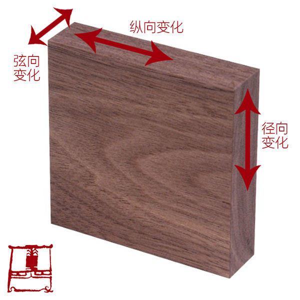
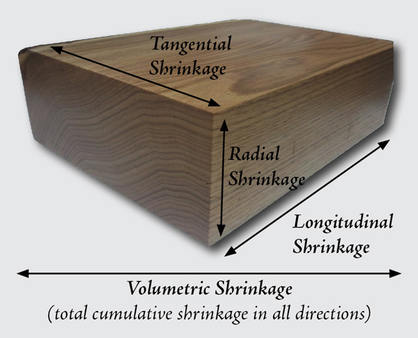
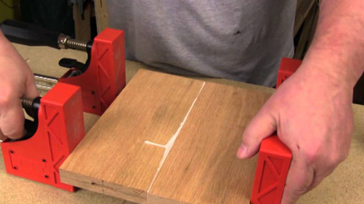
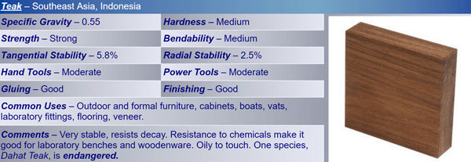

# 木

- 待看文章集合: [老Ken木作](https://zhuanlan.zhihu.com/laokenshuo)

## Catalog
1. 硬木和软木
2. 常见家具木材和价格
3. 常见木材的密度和硬度

## New Words

## Content
### 1. 硬木和软木

### 2. 常见家具木材和价格
#### (1) 橡木
- `橡木: 5500-8000元/m³`, 红橡比白橡略便宜一些. 
- 硬木, 成材期为50年以上至数百年, 树心呈黄褐至红褐, 生长轮明显, 略成波状, 结构粗, 
  色泽淡雅纹理美观, 力学强度相当高, 耐磨损, 但木材不易于干燥锯解和切削, 如大面积采用变形程度大. 

  橡木在我国东北和俄罗斯进口的也叫柞木或栎木, 从北美进口的橡木就严格区分为红橡和白橡.
  需要注意的是红橡不红、白橡并不白, 靠谱的判断方法是木髓射线: 红橡的木髓射线通常较短,
  白橡的木髓射线较长. 

- 

  左为白橡, 右为红橡

- 需要特别指出的是, 橡胶木和橡木并没有什么关系, 虽然只有一字之差.
  橡胶木其实是生产橡胶的树木, 属于亚热带树种, 多分布于我国南部和东南亚广大地区.
  橡胶树成年以后每年都会流出汁液, 这就是橡胶的原料.
  多年以后橡胶树不再产胶之后我们就把它的木材用来加工家具, 这就是所谓的橡胶木. 

- 橡胶木: 2000-3000元/m³
  
  橡胶木和橡木的售价摆在这里, 相信你们绝不想花橡木的钱买了橡胶木, 请擦亮眼睛. 

#### (2) 樱桃木
- `樱桃木: 6000-8000元/m³`
- 樱桃木是高级木料, 木纹是直木纹, 心材颜色由艳红色至棕红色, 边材呈奶白色.
  木材的弯曲性能十分好, 抗弯强度与冲击强度中等, 耐冲击强度中等, 但硬度较低. 力学强度与橡木相当. 

#### (3) 水曲柳
- `水曲柳: 3000-3500元/m³`
- 平直, 坚韧, 纹理清晰美观, 还有很好看的光泽, 可仿珍贵木种. 主要产地为我国东北、华北、
  俄罗斯等地. 装饰面板中用的比例最大的就是水曲柳面板, 之所以采用此种面板, 
  与它的特性是分不开的. 水曲柳最大的优点是在于它的纹路美观清晰, 
  如作为饰面板, 刷清漆或刷白能够最大程度地体现出它美丽的花纹. 

  缺点是收缩变形大, 不适合全实木, 有色差, 干燥时易翘裂. 
  家具店里看到的水曲柳家具大多是主框架用水曲柳实木, 大面积部分都是贴水曲柳实木皮的, 
  就是因为水曲柳变形收缩大原因. 

#### (4) 榆木
- `榆木: 3500-4500元/m³`
- 榆木属于榆科, 榆属, 主产温带, 落叶乔木. 质地坚韧, 有弹性, 适合雕刻, 近似“鸡翅木”花纹, 
  纹理美丽. 缺点是心边材区分明显, 边材为暗黄色, 心材暗紫灰色, 有色差, 老榆木和国产榆木容易生虫. 

#### (5) 榉木
- `榉木: 4000-5500元/m³`
- 榉木属榆科, 也写作“椐木”或“椇木”, 常被简写作“椐”. 同北方的榆木有“南榉北榆”之称. 
 木重, 比普通硬木坚硬, 纹理直且清晰, 质地均匀, 色彩柔和, 
 有光泽, 蒸汽下易弯曲, 可作为曲木使用. 

#### (6) 松木
- `松木: 1000-2000元/m³`
- 性价比最高, 实用性强, 导热性能好且保养简单. 缺点是木质软, 易开裂变形, 还易析出油脂. 

  松木家具占了实木家具很大一部分, 特别是儿童家具许多都是采用松木的.
  松木家具的用材主要有两种, 一种是马尾松, 一种是樟子松, 以樟子松为主,
  在装修中是人造纤维板的重要原材料. 

#### (7) 黑胡桃木
- `黑胡桃木: 15000-18000元/m³`
- 原木盛产于北美洲、北欧等地. 木材心、边材区分明显, 边材浅黄褐色至浅栗褐色,
  心材红褐色至栗褐色, 偶带紫色, 间有深色条纹, 久露空气呈现巧克力色, 生长轮明显.
  含水率低, 适合对结构和强度要高的制作, 但韧性差, 抗压抗弯一般, 需精心防护. 
  
  美国黑胡桃木各方面都较为理想, 材质坚硬细密, 尺寸稳定性好, 胀缩率小, 属于家具中的贵族,
  具有保值功能. 通常用做木皮, 较少用实木. 

  需要指出的是, 作为热门实木品种, 以及巨大的利润空间,
  导致一些黑心商家用质地相近的木材来替代黑胡桃, 被选为替代的木材主要以楸木为主.
  黑胡桃和楸木都是胡桃科胡桃属的乔木, 只是不同地区叫法不同. 

### 3. 常见木材的密度/硬度/胀缩性/强度/着胶性
- [原文: 关于木材物理性能的几个关键](https://zhuanlan.zhihu.com/p/23808074)
#### 密度: 
- 一般我们看到的木材数据中, 会有密度这一项. 为了方便于对比,
  一般这个数值是木材在 12% 的含水率时测量的密度,
  也就是说木材在同样的含水率和体积的情况下去对比重量. 比如小叶紫檀(檀香紫檀)在
  12% 含水率的气干密度是 $1.05 ~ 1.26g/cm^3$, 就是它在特点的含水率 12%
  时每立方厘米重 $1.05 ~ 1.26g$. 那为什么会有一个浮动值? 那是因为同一树种,
  因成长环境的不一样而导致了密度的不一样. 但总体来说这个数值是很重的,
  因为水的密度是 $1g/cm^3$, 所以紫檀是沉于水的. 一般来说, 密度越高的木材,

#### 硬度: 
- 现在比较广泛的硬度测试方法是詹氏测试法, 其通过测量把一颗 11.28mm
  直径的钢珠压到测试样本木材直到钢珠的一半没入到木材中所需的压力来决定木材的硬度,
  所需压力越大, 则木材硬度越大. 那么多硬才算硬呢?
  詹氏硬度数值在2000以上的木材就算非常硬了, 这些硬度在2000以上的木头容易损伤工具,
  所以也非常难加工. 所以硬度越大的木材一般加工难度越大,
  而越硬的木头就越没那么容易被划花. 同时硬度越高的木材, 其承载能力就会越高.
  相对来说詹氏硬度数值 800 以下的木材算比较软, 不适合用于经常有物理接触的表面.
  而常见的缅甸柚木地板 (算十分高档的地板) 的木材硬度是 1050, 大家可以参考一下. 具体各种常见木材硬度见下表:
  
  | 木材名称 | 密度($kg/m^3$) | 硬度(N) |
  | :-----: | :-----: | :-----: |
  | 硬枫木 | 705 | 1450 |
  | 白橡木 | 769 | 1360 |
  | 白蜡木 | 673 | 1320 |
  | 红橡木 |  | 1290 |
  | 白桦 |  | 1260 |
  | (秘鲁)核桃木 | | 1080 |
  | 柚木 |  | 1050 |
  | 黑胡桃木 | 609 | 1010 |
  | 樱桃木 | 561 | 950 |
  | 榆木 |  |  |
  | 榉木 |  |  |
  | 雪松木 | 438 | 900 |

#### 胀缩性: 
- 可分为纵向稳定性, 径向稳定性和弦向稳定性. 一般纵向的稳定性十分好,
  可以不作考虑. 而径向稳定性和弦向稳定性因木而异, 高的变动幅度可达到 10%!
  当然我们可以通过木材处理和结构来处理木材的变动
  (有兴趣的朋友可以看看上几周关于木材处理的3篇文章),
  但是我们建议尽量使用胀缩性没那么大 (稳定) 的木材. 具体纵向径向弦向是什么请看下图:

  

  

#### 木材强度:        
- 不同于硬度, 硬度反映的是表面对外部创伤的抵抗能力, 
  强度是包括抗压缩/拉伸等多维度的能力的指标. 比如作为承重的木件就要较强的强度了. 
  如果只是作为观赏性用的, 对强度要求就没那么高了. 

#### 着胶性: 
- 因为在木作的过程中很多时候我们需要用到胶水来辅助,
  有些着胶性较差的木头就要考虑通过别的方式来保持其接合位的稳定性了.
  说起胶水这个问题, 很多人以为下胶水就是不好, 其实我们祖先在木作的时候也是有用胶水的,
  只是用动物胶. 着胶要注意部位, 弦切面和径切面着胶性较好, 端面的着胶性较差. 
  
  

- 说了那么多, 我们看看具体的数据与描述. 当具体查找资料的时候,
  你可能会查到一些下面那样的表:

   
        
  上图中的是非常常见的木材: 柚木.
  
    + 它的密度约 0.55; 硬度属于中等;
    + 强度属于强;
    + 可弯曲性中等; 径向的稳定性是 5.8% (值越大越不稳定); 弦向稳定性为 2.5%
      (值越大越不稳定) ;
    + 手工工具加工难度中等, 机器价格难度中等. 着胶性较好, 油漆加工性较好.
      常用于室外和正规的家具/柜子/船/实验室台板/地板等. 柚木非常稳定, 不容易腐,
      对于化学品的抵抗性非常好, 触感较油, 有些柚木已经濒临绝种 (如泰国的柚木). 