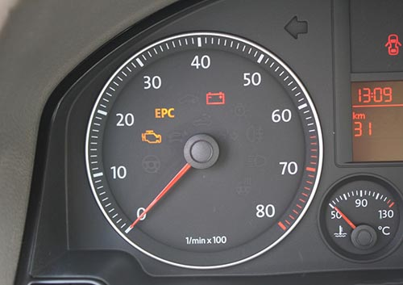
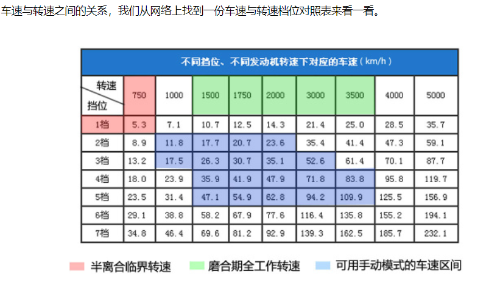

## 科目三考试内容
- **一、上车** 
    + 上车调座椅，录入指纹，听到语音播报开始考试时后，下车绕车一周按2个传感器(2秒)，再上车系安全带。
- **二、模拟灯光考试**
    + (1) 请开启前照灯。
    + (2) 夜间在照明良好的道路上行驶 **近光灯** . (如果灯光在近光灯上不需要动)
    + (3) 夜间与机动车会灯 **近光灯** . (如果灯光在近光灯上不需要动)
    + (4) 夜间直行通过路口 **近光灯** . (如果灯光在近光灯上不需要动)
    + (5) 夜间同方向跟车行驶 **近光灯** . (如果灯光在近光灯上不需要动)
    + (6) 夜间在没有路灯，照明不良条件下行驶 **远光灯** .
    + (7) 夜间超越前方车辆  **远近交替灯光** .
    + (8) 夜间通过急弯，坡路 **远近交替** .
    + (9) 夜间没有交通信号灯控制的路口 **远近交替** .
    + (10) 夜间通过急弯人行横道 **远近交替** .
    + (11) 路边临时停车 **大灯回小灯后开启四角灯** .
    + 注意: 交替远近光时，如果灯光在远光灯上，要回到近光灯后再打远近交替，在近光直接远近交替；路边临时停车后需要注意
       随机出现的灯光，例如有远光、近光、远近交替时，都要先把四角灯关闭，小灯换回大灯，再打远光，近光或者交替远近灯光。
- **三、起步** (一打二鸣，三踩离合四挂挡，五松手刹六回头 )
    + (1) 打转向灯
    + (2) 鸣笛 2 秒
    + (3) 踩离合
    + (4) 挂一档
    + (5) 松手刹
    + (6) 回头观察路况安全起步 (一档不能超过 20 迈换成二档，一档不能长距离行驶)
- **四、超车**
    + 听到语音播报后打左转向灯 3s 后，向后观察路况再进入超车道，车身正后打右转向灯 3 秒后驶回原车道 (超车细节: 先打转向灯 3 秒后，
       回头观察路况确保安全后再打方向盘。超车 150 米完成。)
    + **注意: 3 秒停顿，一定要记得**   
- **五、直线行驶**
    + 微调方向盘，保持直线行驶 100 米。
- **六、**
    + (1)路口直行 (2)学校区域 (3)公交站台 (4)会车 (以上 4 项听到语音播报左右观察后视镜，轻点刹车。 
        其中会车听到语音后点刹车，在车道内向右缓打方向盘 3 秒后回正，不要压到实现。 )   
    + **注意: 一定记得轻点刹车。**    
- **七、变更车道**
    + 听到项目语音后打转向灯 3 秒后，回头观察确认安全后，缓打方向盘进入目标车道。
- **八、左转弯，右转弯**
    + 听到语音播报后，开启转向灯，观察左右安全后进入进入相应车道。重点必须有轻点刹车动作。
    + 注意: 转弯前的人行横道之前一定要轻点刹车。
- **九、加减挡**
    + 2 档加速到 25~30 码之间换 3 档，
    + 3 档加速到 35~40 码之间换 4 档
    + 4 档加速到 40 码松开离合油门，低于 40 换三档，低于 35 换二挡。
    + 注意: 4档减到3档到2档松离合不能太慢，挂挡切记不能挂偏，挡位一定要挂对。 
- **十、掉头** 
    + 占掉头车道，听到语音后开启左转向灯，在掉头地点停车。(注意: 停车摘档后不要松脚刹，回头观察路况确认安全后挂 1 档掉头)
    + 注意: 听到掉头时要打转向灯，停车再起步之前一定要注意此时转向灯是否还亮着。
- **十一、靠边停车** 
    + 语音播报后开启右转向灯，3 秒后缓慢进入边道，看自己 12 点钟方向在车道中间的位置方可停车，150米内完成。
       大于 30cm 扣 10 分，大于 50cm 扣 100 分。停车完成后摘档，拉手刹，熄火，解安全带后，松脚刹开门
       下车，关门后在车外灯播报成绩。(祝你顺利通过科三考试)
    + 注意:
        - 进入停车道之前一定要看右方是否有车。
        - 踩离和(拐入停车道前已经踩了)踩脚刹，摘档拉手刹，熄火后解安全带，松脚刹后下车。
        - 下车之前一定观察后方是否有车。

      

## 手动档起步正确方法详解: [详细视频讲解(需翻墙)](https://www.youtube.com/watch?v=IR5s_DUA1l4)
- 平稳又快速的起步方式: 离合踩到底挂一档松手刹，这个时候不一定是左脚抬到半联动点的时候，右脚立刻把油补上，
  这样太难了，给出的建议是: 油门稍微提前一点，右脚踩到油门上把转速提到 1500 转到 2000 转左右，同时
  左脚慢慢的去抬离合，大概在半联动点位置左右的时候车子动起来了，稳住一下(大约1-2s)我们再松开离合(此时可
  直接松开离合了)，就完成了起步的动作；这样的好处就是离合的半联动点会变得非常广，你在这个点的周围
  不管前面一点或者后面一点，只要右脚油门稳住了，都可以完成起步，而且不容易熄火。
   (先松离合到半联动，车子走动后再给油门的问题是: 此时的离合半联动位置包容度比较低，你必须比较精准的
   找到这个半联动的点，而且稍微抬快了一点就会容易熄火，所以此种方法造成的问题就是起步时间会比较长。)

## 手动档行驶过程中换挡的详细操作: 
> 在开车时除了**汽车起步**、**换挡**和**低速刹车**需要踩下离合器踏板外，其他时间都不要没事踩离
    合或把你的脚放在离合器踏板上。
- **1、踩离合，松油门** (正确顺序是: 踩离合和松油门应同时 (或几乎同时) 进行。就算有个先后顺序，
    也是 "踩离合在先，松油门在后"。)
    + 先踩离合后松油门: 注意松油门的时间不能太滞后，否则，由于踩下离合后相当于卸去了发动机的负荷，
      而油门又未及时松开的话，发动机转速会迅速升高，这是烧的油算是白费了。踩离合同时松油门后，
      发动机转速随之开始下降。
    + 先松油门后松离合的情况: 如果先松油门后踩离合，由于发动机停止供油而离合器未分离，可能出现
      “反拖”即发动机制动现象，这会产生“顿挫(搓车)”冲击感。当档位较高（如四、五档行驶）时，发动机制动
      作用较轻，不会有多大感觉，但档位较低（如二、三档行驶）时，“顿挫”感就会比较明显。
- **2、换挡** 
    + 正常情况下，由于同步器的作用，一对待啮(nie)合的两个齿轮在转速未达到同步前是不会接触的，因此不会产生
      齿轮撞击。转速同步后，两齿轮会顺利啮合，所以这一步也不会产生什么冲击。不仅如此，换挡时如操作
      （施力大小、换入时机）得当，还会产生类似换挡杆被自动吸入到位的感觉，这对驾驶者来说，不啻为一种“快意”。   
- **3、松离合的同时加油门**
    + 简单来说: 换入挡位后，1档2档慢抬离合，3档缓抬离合，4档5档后稍快抬，在每个挡位抬到半离合时稍停顿一下，
      在抬离合的同时缓加油门，实行离抬油踩的油离配合。
    + tips: 松离合器就加油门，踩离合器时油门就减光。 

## 加减挡注意事项:
- 换挡时机取决于车子有没有劲
- 档位与车速之间的关系(记住: 快到多少码时，换几档。)

档位 | 速度允许区间(km/h) | 换档时机
--- | ------------- | -------
1档 | 0~20  | 15~20 码之间换 2 档
2档 | 10-30 | 25~30 码之间换 3 档
3档 | 20-40 | 35~40 码之间换 4 档 (注意: 这个要问问是真假: 3档在考试时绝不能超过 40，否则就会提示"挡位与速度不匹配"！)
4档 | 30-50 | 考试暂无要求 (换 5 挡时机是35~40)
5档 | 40 以上| (考试暂无要求)

- 减速: (速度降下来时，要及时减档，否则会造成挡位与速度不匹配。)

- 加挡看转速表(tips:新手不容易看出来，而且时间有限)，减档看时速表
    + 我们来说一下开车的升档时机:
        - 1 档 1000-1500 转 [tr(turn)/min]左右，车速 10km/h 然后换到 2 档。
        - 2 档 加油门，发动机转速 1500-2000tr/min 左右 车速达到 30km/h 然后松油门，换 3 档。
        - 3 档 加油门，发动机转速 1500-2000tr/min 左右 车速达到 40km/h 然后松油门，换 4 档。
        - 4 档 加油门，发动机转速 1500-2000tr/min 左右 车速达到 30km/h 然后松油门，换 5 档。
        - 5 档 加油门，发动机转速 1500-3000tr/min 左右，车速达到 80-120km/h
    + 
    + 

- 降档时机: (按照上面的: 档加速到 40 码松开离合油门，落到 35 码换 3 档， 落到 30 码换 2 档.)
    + 车速降到 40-50 时采用 4 档     
    + 车速降到 30-40 时采用 3 档     
    + 车速降到 10-30 时采用 2 档     
    + 车速降到 0-10 时采用 1 档   

## 如何防止手动档换档时的顿挫感（跟趾动作[暂时用不到]）？
- 首先要记住换挡的分解动作 (踩离合--挂空挡--松离合同时加油[加油是为了维持发动机的转速，因为一踩下离合，转速就会快速下降，
    再松开离合，就会造成转速和车速不匹配，至于加多少油因车而异，因时而异]--踩离合--挂挡)
- 降档补油，高档到低档防止顿挫和保持加速的做法，跟趾就是在减速的时候降档补油。    